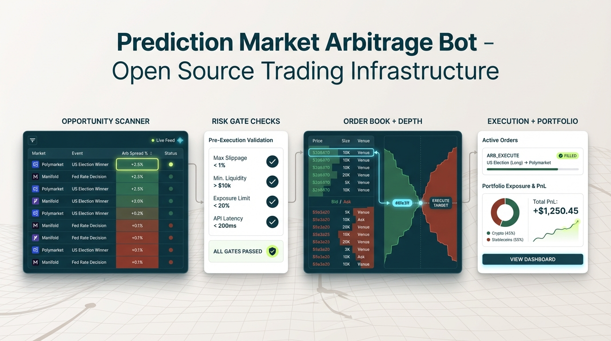

# OpenPolyTrader

[](https://github.com/freshtechbro/openpolytrader/actions/workflows/ci.yml)
[](https://www.typescriptlang.org/)
[](LICENSE)
[](docs/Testing/strategy.md)

> **Near-zero-risk Polymarket CLOB arbitrage automation** with event-sourced state, agent orchestration, and an ops dashboard.

<p align="center">
  
  <br />
  <sub>Polymarket operations view: order books, scanner/risk/execution flow, and portfolio exposure.</sub>
</p>

---

## 📋 Table of Contents

- [🚀 Highlights](#-highlights)
- [📊 Strategy](#-strategy)
- [🏗️ Architecture](#️-architecture)
- [⚡ Quickstart](#-quickstart)
- [⚙️ Configuration](#️-configuration)
- [🔌 Ops API](#-ops-api)
- [📦 Scripts](#-scripts)
- [📚 Documentation](#-documentation)
- [🤝 Contributing](#-contributing)
- [🔒 Security](#-security)
- [📄 License](#-license)

---

## 🚀 Highlights

| Feature | Description |
|---------|-------------|
| 🤖 **Agent Pipeline** | Scanner → Risk → Execution → Portfolio (event-driven architecture) |
| 📝 **Event-Sourced State** | SQLite-backed EventStore for audit trail and crash recovery |
| 📡 **Real-time Telemetry** | Ops API + SSE stream for live monitoring |
| 🎛️ **React Dashboard** | Vite-powered UI for monitoring and configuration |
| 🛡️ **Risk Profiles** | `near_zero`, `moderate`, `high`, `extra_high` with runtime switching |
| 🧠 **LLM Advisory** | Bounded, conservative AI support across all agents |
| ⚡ **Deterministic Execution** | Idempotency + timeout controls for reliable trading |
| 📋 **Market Catalog** | Controlled trading universe with allowlist gating |

---

## 📊 Strategy

### Core Principles

1. **Universe Control**: Load an explicit market catalog, seed the allowlist, and quarantine markets after incidents
2. **Opportunity Types**:
   - **Near-zero arbitrage** (default): Exploit YES+NO pricing inefficiencies
   - **EV signals** (optional): Enable via `signalMode=ev` for expected value trading
3. **Risk Gating**: Enforce depth, spread, freshness, sizing caps, and daily loss limits before execution
4. **Execution Discipline**: Timeouts and idempotency enforced; delayed/partial fills trigger conservative handling
5. **Post-Trade Management**: Portfolio reconciliation and incident tracking with automatic quarantines

---

## 🏗️ Architecture

### System Overview

```
External Services
  Gamma API -> MarketCatalogRefresher -> MarketCatalog -> Allowlist
  Polymarket WS/REST -> MarketDataAgent -> Orderbooks
  Polymarket Data API -> PortfolioAgent

Core Flow
  SignalAggregatorAgent -> ScannerAgent -> RiskAgent -> ExecutionAgent -> PortfolioAgent
  PortfolioAgent -> EventStore -> Ops API -> Dashboard

Ops/Telemetry
  OpsAgent -> Ops API (/health, /metrics, /slo, /stream)
  MessageBus connects agents and events end-to-end
```

### Agent Pipeline

```
┌─────────────────────┐     ┌─────────────┐     ┌──────────┐     ┌────────────┐     ┌────────────────┐
│ SignalAggregatorAgent│────▶│ ScannerAgent │────▶│ RiskAgent │────▶│ ExecutionAgent │────▶│ PortfolioAgent │
└─────────────────────┘     └─────────────┘     └──────────┘     └────────────┘     └────────────────┘
        │                           │                  │                │                    │
        ▼                           ▼                  ▼                ▼                    ▼
   Detects                    Validates          Executes          Reconciles
   opportunity                 gates              orders            positions
```

### Technology Stack

| Layer | Technology |
|-------|------------|
| **Backend** | TypeScript, Fastify, Node.js 20+ |
| **Database** | SQLite (event sourcing) |
| **Frontend** | React 18, Vite |
| **Testing** | Vitest (95% coverage), Playwright (E2E) |
| **Blockchain** | Ethers.js, Polygon POS |
| **Real-time** | WebSocket, SSE |

---

## ⚡ Quickstart

### 🎯 Recommended: Ops Dev Mode (Backend + Dashboard)

Starts both backend and dashboard with a single command:

```bash
npm install
npm run dev:ops
```

**Access Points:**
- Backend: http://localhost:3000
- Dashboard: http://localhost:5174

**Requirements:**
- Set `OPS_API_TOKEN` or `VITE_OPS_API_TOKEN` in `dashboard/.env`
- See [setup guide](docs/Development/setup.md) for details

**Stop:**
```bash
npm run dev:ops:down
```

---

### 🐳 Docker Mode (Backend + Local Dashboard Dev Server)

```bash
npm install
npm run dev:live
```

Starts the backend in Docker and the dashboard with a local Vite dev server.

**Access Points:**
- Backend: http://localhost:3000
- Dashboard: http://localhost:5173

**Stop:**
```bash
npm run dev:live:down
```

---

### 🔧 Backend Only

```bash
npm install
npm run dev
```

---

### 🎨 Dashboard Only

```bash
cd dashboard
npm install
npm run dev
```

---

### 🛠️ Build Commands

```bash
# Build backend + dashboard + Docker images
npm run build:all

# Build and start Docker containers
npm run build:all:up

# Build and start backend + dashboard (dev server)
npm run build:all:live
```

---

## ⚙️ Configuration

### Environment Setup

1. Copy `.env.example` to `.env`:
   ```bash
   cp .env.example .env
   ```

2. Edit `.env` with your settings (see [config guide](docs/Operations/config-knobs.md))

### Key Settings

| Variable | Default | Description |
|----------|---------|-------------|
| `TRADING_ENABLED` | `true` | Set `false` to hard-disable trading |
| `TRADING_MODE` | `shadow` | Options: `off`, `shadow`, `paper`, `live` |
| `RISK_PROFILE` | `extra_high` | Options: `near_zero`, `moderate`, `high`, `extra_high` |
| `OPS_API_TOKEN` | - | Recommended for API security |
| `TOTAL_CAPITAL` | `1000` | Starting capital in USD |

### Risk Profile Behavior

- If `RISK_PROFILE` is explicitly set, it takes precedence on boot
- Applied profiles persist to `settings/risk-gates/active.json`
- Runtime changes via Ops API override env settings

### Live Trading Requirements

Near-zero-risk live mode requires:
- `POLYMARKET_USER_WS_URL` (user channel connectivity)
- Valid trading credentials:
  - `ALCHEMY_API_KEY`
  - `POLYMARKET_API_KEY`
  - `POLYMARKET_API_SECRET`
  - `POLYMARKET_PASSPHRASE`

---

## 🔌 Ops API

Base URL: `http://localhost:3000`

### Endpoints

#### Health & Monitoring
- `GET /health` - System health status
- `GET /health/live` - Liveness probe (Docker)
- `GET /health/ready` - Readiness probe (returns 503 if degraded)
- `GET /metrics` - JSON metrics snapshot (`counts` + `lastEventAt`)
- `GET /slo` - Service Level Objectives

#### Configuration
- `GET /config` - Current configuration snapshot
- `GET /config/schema` - Policy/risk schema for UI
- `GET /config/infra` - Infrastructure config (read-only)
- `GET /config/risk-profiles` - Available risk profiles
- `PATCH /config/policy` - Update trade policy
- `PATCH /config/risk` - Update risk settings
- `POST /config/risk-profile` - Apply risk profile

#### Operations
- `GET /allowlist` - Market allowlist state
- `POST /allowlist/:marketId/resume` - Resume quarantined market
- `GET /incidents` - Recent incidents
- `GET /stream` - SSE real-time events

### Authentication

When `OPS_API_TOKEN` is set:
```bash
curl -H "Authorization: Bearer $OPS_API_TOKEN" http://localhost:3000/health
```

---

## 📦 Scripts

### Backend

| Script | Description |
|--------|-------------|
| `npm run dev` | Start backend (tsx) |
| `npm run dev:ops` | Start backend + dashboard |
| `npm run dev:ops:down` | Stop dev:ops processes |
| `npm run dev:live` | Docker backend + local dashboard dev server |
| `npm run dev:live:down` | Stop Docker backend |
| `npm run build` | Compile TypeScript |
| `npm run build:all` | Build backend + dashboard + Docker |
| `npm run start` | Run compiled backend |
| `npm run lint` | ESLint check |
| `npm run typecheck` | TypeScript check (no emit) |
| `npm run test` | Run unit + integration tests |
| `npm run test:coverage` | Run tests with 95% coverage |
| `npm run catalog:refresh` | Refresh market catalog |

### Dashboard

| Script | Description |
|--------|-------------|
| `npm run dev` | Vite dev server |
| `npm run build` | Production build |
| `npm run test:e2e` | Playwright E2E tests |

---

## 📚 Documentation

### Architecture & Design
- [`docs/ARCHITECTURE.md`](docs/ARCHITECTURE.md) - System architecture and agent flow
- [`docs/Development/architecture-decisions.md`](docs/Development/architecture-decisions.md) - Architectural Decision Records (ADRs)

### Development
- [`docs/Development/setup.md`](docs/Development/setup.md) - Dev setup and environment
- [`docs/Development/market-catalog.md`](docs/Development/market-catalog.md) - Market catalog generation
- [`CONTRIBUTING.md`](CONTRIBUTING.md) - Contribution guidelines

### Operations
- [`docs/Operations/runbook.md`](docs/Operations/runbook.md) - Operational guidance
- [`docs/Operations/config-knobs.md`](docs/Operations/config-knobs.md) - Configuration reference
- [`docs/Operations/security.md`](docs/Operations/security.md) - Security procedures
- [`docs/Operations/README.md`](docs/Operations/README.md) - Operations rollout guide

### Testing
- [`docs/Testing/strategy.md`](docs/Testing/strategy.md) - Test strategy and coverage

### Project Context
- [`AGENTS.md`](AGENTS.md) - Comprehensive project knowledge base

---

## 🤝 Contributing

We welcome contributions! Please see [CONTRIBUTING.md](CONTRIBUTING.md) for:
- Development setup
- Coding standards
- Testing requirements (95% coverage)
- Pull request process
- Commit message conventions

---

## 🔒 Security

- **Never commit secrets** (API keys, private keys)
- Store credentials in environment variables
- Use `OPS_API_TOKEN` to secure the Ops API
- Rotate keys regularly

See [docs/Operations/security.md](docs/Operations/security.md) for detailed security procedures.

---

## 📄 License

MIT License - see LICENSE file for details.

---

## 🆘 Support

- 📖 Documentation: Check the [docs/](docs/) folder
- 🐛 Issues: Open a GitHub issue
- 💬 Discussions: Use GitHub Discussions for questions

---

<p align="center">
  Built with ⚡ by the OpenPolyTrader team
</p>
