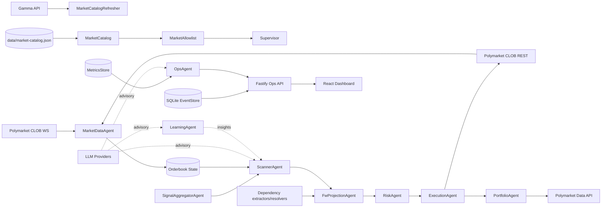

# OpenPolyTrader Knowledge Base

**Generated:** 2026-02-17
**Commit:** d258f66
**Branch:** main
**Version:** 0.1.0

---

## 📋 Navigation

- [Overview](#overview)
- [Project Structure](#project-structure)
- [Where to Look](#where-to-look)
- [Complexity Hotspots](#complexity-hotspots)
- [Agent Flow](#agent-flow)
- [Architecture Diagrams](#architecture-diagrams)
- [Documentation Index](#documentation-index)
- [Anti-Patterns](#anti-patterns)
- [Conventions](#conventions)
- [Commands](#commands)
- [API Endpoints](#api-endpoints)
- [Key Dependencies](#key-dependencies)
- [Notes](#notes)

---

## Overview

Near-zero-risk Polymarket CLOB arbitrage bot. TypeScript + Fastify backend, React dashboard. Agent-based architecture with event-sourced state.

**Project Stats:**
- 99 TypeScript source files
- 33 Dashboard TypeScript/TSX files
- 9 Specialized agents
- >97% test coverage requirement
- 210 environment configuration options

---

## Project Structure

```
openpolytrader/
├── src/
│   ├── agents/        # Specialized agents + dependency/projection modules (9 agent classes)
│   │   ├── dependency/  # LLM dependency extraction/resolution helpers
│   │   ├── execution/   # Order execution logic (2229 lines - complexity hotspot)
│   │   ├── learning/    # RL model integration
│   │   ├── market-data/ # WebSocket data handling
│   │   ├── ops/         # Operations and health monitoring
│   │   ├── portfolio/   # Position management (650 lines, 21262 bytes)
│   │   ├── projection/  # Frank-Wolfe projection agent
│   │   ├── risk/        # Risk evaluation
│   │   ├── scanner/     # Opportunity detection
│   │   └── signal/      # Signal aggregation + web search
│   ├── core/          # Supervisor (1054 lines, 36589 bytes), MessageBus, EventStore
│   ├── domain/        # Business logic, types, state machines, gates.ts
│   ├── services/      # External API clients (Polymarket, Polygon)
│   ├── config/        # Env, policy, risk settings (14 files)
│   ├── venues/        # VenueAdapter abstraction
│   ├── telemetry/     # Metrics, SLO monitoring
│   ├── security/      # Auth, secrets
│   ├── api/           # Fastify ops endpoints
│   ├── db/            # SQLite migrations
│   ├── tools/         # CLI tools (market catalog generator)
│   ├── utils/         # Shared utilities
│   └── main.ts        # Entry point (867 lines, 30552 bytes)
├── dashboard/         # React/Vite ops dashboard
│   ├── src/
│   │   ├── components/  # Reusable UI (14 files)
│   │   ├── pages/       # Route views (11 files, RiskGates.tsx 708 lines / 27694 bytes)
│   │   ├── hooks/       # Custom hooks
│   │   ├── lib/         # Utilities (opsClient, config)
│   │   └── styles/      # CSS (tokens.css, app.css)
│   └── tests/e2e/       # Playwright E2E tests
├── tests/             # Vitest unit + integration
│   ├── unit/            # 84 test files
│   ├── integration/     # 5 test files
│   └── fixtures/        # Test fixtures
├── docs/              # Comprehensive documentation
│   ├── ARCHITECTURE.md
│   ├── Development/
│   │   ├── setup.md
│   │   ├── market-catalog.md
│   │   └── architecture-decisions.md
│   ├── Operations/
│   │   ├── runbook.md
│   │   ├── config-knobs.md
│   │   ├── security.md
│   │   └── README.md
│   └── Testing/
│       └── strategy.md
├── scripts/           # Dev scripts (dev-up.sh, dev-down.sh)
├── data/              # SQLite database, market catalog
├── settings/          # Risk profile persistence
└── tmp/               # Logs during dev:ops
```

---

## Where to Look

| Task | Location | Notes |
|------|----------|-------|
| **Trading logic** | `src/agents/execution/` | State machine, 2229 lines / 69053 bytes |
| **Risk gates** | `src/domain/gates.ts` | Pre-trade validation (edge, depth, staleness) |
| **Portfolio state** | `src/agents/portfolio/` | Positions, PnL, reconciliation (650 lines / 21262 bytes) |
| **FW projection** | `src/agents/projection/` | Dependency-aware projection opportunities before risk gating |
| **Market scanning** | `src/agents/scanner/` | Opportunity detection |
| **Signal aggregation** | `src/agents/signal/` | EV signal aggregation + web search |
| **API clients** | `src/services/` | PolymarketClob, PolymarketRealtime, PolymarketDataApi |
| **Configuration** | `src/config/` | env.ts, policy.ts, risk.ts, schema.ts |
| **Event bus** | `src/core/MessageBus.ts` | Typed agent communication |
| **Persistence** | `src/core/EventStore.ts` | SQLite event sourcing |
| **Orchestration** | `src/core/Supervisor.ts` | Agent lifecycle, pipeline flow (1054 lines / 36589 bytes) |
| **Dashboard UI** | `dashboard/src/` | React components + pages |
| **Risk config UI** | `dashboard/src/pages/RiskGates.tsx` | 708 lines / 27694 bytes |
| **Tests** | `tests/unit/`, `tests/integration/` | >97% coverage requirement |

---

## Complexity Hotspots

| File | Lines | Bytes | Why |
|------|-------|-------|-----|
| `src/agents/execution/ExecutionAgent.ts` | 2229 | 69053 | State machine, timeouts, unwinds, idempotency |
| `tests/unit/execution.test.ts` | 2843 | 101303 | Comprehensive execution tests |
| `tests/unit/portfolio.test.ts` | 1283 | 35808 | Portfolio reconciliation tests |
| `src/core/Supervisor.ts` | 1054 | 36589 | Agent orchestration, circuit breakers |
| `src/agents/portfolio/PortfolioAgent.ts` | 650 | 21262 | Position management, venue reconciliation |
| `dashboard/src/pages/RiskGates.tsx` | 708 | 27694 | Risk config editing UI |
| `src/main.ts` | 867 | 30552 | Application bootstrap and initialization |

---

## Agent Flow

```
SignalAggregatorAgent → ScannerAgent → (optional) FwProjectionAgent → RiskAgent → ExecutionAgent → PortfolioAgent
```

**Event Flow:**
```
market:updated → opportunity:detected → fw_projection (optional) → risk:approved → execution_lifecycle → execution:fill
```

---

## Architecture Diagrams

### System Architecture



### Decision and Trade Flow

```mermaid
flowchart TD
  MarketUpdate[Market update (WS/REST)] --> ScannerAgent
  ScannerAgent --> Opportunity[Arbitrage opportunity]
  Opportunity --> FwProjection[Optional FW projection]
  FwProjection --> Gates[evaluateGates]
  Gates -->|pass| RiskAgent
  Gates -->|fail| GateReject[gate_rejection metric]
  RiskAgent --> ExecutionAgent
  ExecutionAgent --> Orders[Place orders]
  Orders --> PortfolioAgent
  PortfolioAgent --> EventStore
  OpsAgent --> OpsApi
  OpsApi --> Dashboard

  LLMs[LLM advisory] -. scoring/summary .-> ScannerAgent
  LLMs -. health summary .-> OpsAgent
```

---

## Documentation Index

### 📖 Core Documentation

| Document | Purpose |
|----------|---------|
| [`README.md`](README.md) | Project overview, quickstart, API reference |
| [`CONTRIBUTING.md`](CONTRIBUTING.md) | Development setup, coding standards, PR process |
| [`AGENTS.md`](AGENTS.md) | This file - comprehensive project knowledge |

### 🏗️ Architecture & Design

| Document | Purpose |
|----------|---------|
| [`docs/ARCHITECTURE.md`](docs/ARCHITECTURE.md) | System architecture, agent details, data flow |
| [`docs/ARCHITECTURE_EVENT_FLOW.asc`](docs/ARCHITECTURE_EVENT_FLOW.asc) | ASCII end-to-end event flow diagram |
| [`docs/Development/architecture-decisions.md`](docs/Development/architecture-decisions.md) | ADRs for key architectural choices |

### 💻 Development

| Document | Purpose |
|----------|---------|
| [`docs/Development/setup.md`](docs/Development/setup.md) | Dev environment setup |
| [`docs/Development/market-catalog.md`](docs/Development/market-catalog.md) | Market catalog generation |
| [`docs/API.md`](docs/API.md) | Full Ops API reference |

### 🔧 Operations

| Document | Purpose |
|----------|---------|
| [`docs/Operations/environment-reference.md`](docs/Operations/environment-reference.md) | Minimum requirements + complete env var inventory |
| [`docs/Operations/runbook.md`](docs/Operations/runbook.md) | Operational guidance, health checks |
| [`docs/Operations/config-knobs.md`](docs/Operations/config-knobs.md) | Configuration reference |
| [`docs/Operations/security.md`](docs/Operations/security.md) | Security procedures |
| [`docs/Operations/README.md`](docs/Operations/README.md) | Operations documentation index |

### 🧪 Testing

| Document | Purpose |
|----------|---------|
| [`docs/Testing/strategy.md`](docs/Testing/strategy.md) | Test strategy and coverage |

### 📚 Local AGENTS.md Files

Local context files throughout the codebase:
- `src/AGENTS.md` - Source code overview
- `src/agents/AGENTS.md` - Agent architecture
- `src/core/AGENTS.md` - Core systems
- `src/services/llm/AGENTS.md` - LLM integration
- `dashboard/src/AGENTS.md` - Dashboard overview
- `tests/unit/AGENTS.md` - Testing patterns
- `tests/integration/AGENTS.md` - Integration testing

---

## Anti-Patterns (THIS PROJECT)

### 🛡️ Risk Management - NEVER

- Accept inventory risk by design
- Retry failed orders without fresh book check (single-shot policy)
- Exceed position size limits or depth caps
- Assume atomic multi-leg execution
- Trade without explicit enable + kill-switches

### 🔒 Security - NEVER

- Commit secrets, .env files, API keys
- Include secrets in logs or telemetry
- Put API keys in RPC URLs (use base URL only)

### 💻 Development - NEVER

- Mix unrelated changes in commits
- Use `as any`, `@ts-ignore`, `@ts-expect-error`
- Guess - mark uncertainties as UNCONFIRMED
- Mock internal systems in integration tests without justification

### ⚙️ Operations - ALWAYS

- Fetch current `tick_size` from `/book` before placing orders
- Check `asks` array for actual execution prices
- Handle timeouts deterministically to avoid duplicate orders

---

## Conventions

### TypeScript

- **Target:** ES2022, NodeNext modules, strict mode
- **Module system:** ESM (`"type": "module"`)
- **Data structures:** Interfaces
- **Stateful services:** Classes
- **Runtime validation:** Zod
- **Unused variables:** Prefix with `_`

### Architecture

- **Pattern:** Agent-based (Scanner → optional FW projection → Risk → Execution → Portfolio)
- **State management:** Event-sourced (not direct mutation)
- **Communication:** MessageBus for inter-agent
- **Exchange abstraction:** VenueAdapter
- **Dependency injection:** Constructor DI with optional defaults

### Naming

- **Internal code:** camelCase
- **External API fields:** snake_case
- **Tests:** `*.test.ts` for unit/integration, `*.spec.ts` for e2e

### Testing

- **Framework:** Vitest
- **Coverage:** >97% requirement
- **Mocking:** `vi.mock()` for external dependencies
- **Cleanup:** `afterEach` for integration tests

---

## Commands

### Backend

```bash
npm run help             # root command/tool/flag reference
npm run h                # alias for help
npm run dev              # tsx src/main.ts
npm run dev:ops          # backend + dashboard (scripts/dev-up.sh)
npm run dev:ops:down     # stop dev:ops processes
npm run dev:live         # Docker backend + local dashboard dev server
npm run dev:live:down    # Stop Docker backend
npm run build            # tsc compilation
npm run build:all        # build backend + dashboard + Docker images
npm run build:all:up     # build everything and start Docker containers
npm run build:all:live   # build everything and start backend + dashboard dev server
npm run start            # node dist/main.js
npm run lint             # eslint --max-warnings=0
npm run typecheck        # tsc --noEmit
npm run test             # vitest run
npm run test:coverage    # >97% thresholds
npm run catalog:refresh  # refresh market catalog
npm run catalog:refresh:dev -- --help # show market catalog generator CLI help
```

### Dashboard

```bash
cd dashboard
npm run dev              # Vite dev server :5173 (dev:ops uses 5174)
npm run build            # Production build
npm run test:e2e         # Playwright
```

### Docker

```bash
docker compose up        # Local deployment
```

---

## API Endpoints

Base: `http://localhost:3000`

Reference: [`docs/API.md`](docs/API.md)

| Endpoint | Description |
|----------|-------------|
| `GET /health` | Health check |
| `GET /health/live` | Liveness probe (Docker) |
| `GET /health/ready` | Readiness probe (503 if degraded) |
| `GET /metrics` | JSON metrics snapshot (`counts` + `lastEventAt`) |
| `GET /slo` | Service Level Objectives |
| `GET /allowlist` | Market allowlist state |
| `GET /markets` | Allowlist entries enriched with market metadata |
| `GET /incidents` | Incident log |
| `GET /portfolio` | Portfolio snapshot |
| `GET /decisions` | Decision history query |
| `GET /stream` | SSE real-time events |
| `GET /config` | Configuration snapshot |
| `GET /config/schema` | Runtime editable policy/risk schema |
| `GET /config/infra` | Infra config snapshot (read-only) |
| `GET /config/risk-profiles` | Active + available risk profiles |
| `PATCH /config/policy` | Update trade policy |
| `PATCH /config/risk` | Update risk settings |
| `POST /config/risk-profile` | Apply risk profile |
| `POST /config/trading-mode` | Change trading mode/enabled state |
| `POST /allowlist/:marketId/resume` | Resume quarantined market |

Auth: `Authorization: Bearer $OPS_API_TOKEN`

---

## Key Dependencies

| Package | Purpose |
|---------|---------|
| **fastify** | API server |
| **ethers** | Polygon blockchain |
| **better-sqlite3** | Event store |
| **ws** | WebSocket client |
| **zod** | Schema validation |
| **react** | Dashboard UI |
| **vitest** | Testing framework |
| **playwright** | E2E testing |

---

## Notes

### Configuration

- Dashboard auth: use runtime `/ops/*` session login with `OPS_API_TOKEN` (no build-time token)
- Defaults in `.env.example`: `TRADING_ENABLED=true`, `TRADING_MODE=shadow`, `RISK_PROFILE=extra_high`
- To hard-disable trading: set `TRADING_ENABLED=false` or `TRADING_MODE=off`
- Market catalog: Optional `MARKET_CATALOG_PATH` JSON array

### Development

- Local GitHub Actions workflow present at `.github/workflows/ci.yml`
- Logs during `dev:ops`: `tmp/backend.log`, `tmp/dashboard.log`
- SQLite database: `data/openpolytrader.db`
- Risk profiles persisted to: `settings/risk-gates/active.json`

### Safety

- Near-zero-risk live mode requires user channel connectivity
- All LLM interactions are strictly advisory (no autonomous trading)
- Circuit breakers protect against cascade failures
- Automatic market quarantine after incidents

---

<p align="center">
  <strong>OpenPolyTrader</strong> - Near-zero-risk arbitrage automation
</p>
