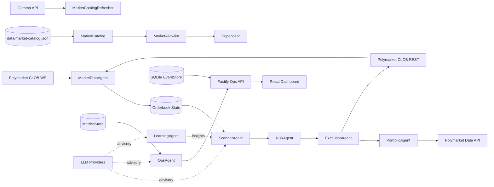

# OpenPolyTrader Knowledge Base

**Generated:** 2026-01-05  
**Commit:** caea9e7  
**Branch:** main

## Overview

Near-zero-risk Polymarket CLOB arbitrage bot. TypeScript + Fastify backend, React dashboard. Agent-based architecture with event-sourced state.

## Structure

```
openpolytrader/
├── src/
│   ├── agents/        # Trading agents (scanner, risk, execution, portfolio, ops, learning, market-data)
│   ├── core/          # Supervisor, MessageBus, EventStore
│   ├── domain/        # Business logic, types, state machines
│   ├── services/      # External API clients (Polymarket, Polygon)
│   ├── config/        # Env, policy, risk settings
│   ├── venues/        # VenueAdapter abstraction
│   ├── telemetry/     # Metrics, SLO monitoring
│   ├── security/      # Auth, secrets
│   ├── api/           # Fastify ops endpoints
│   ├── db/            # SQLite migrations
│   └── main.ts        # Entry point
├── dashboard/         # React/Vite ops dashboard
├── tests/             # Vitest unit + integration
└── docs/              # Architecture, research, plans
```

## Where to Look

| Task | Location | Notes |
|------|----------|-------|
| Trading logic | `src/agents/execution/` | State machine, 1557 lines - complexity hotspot |
| Risk gates | `src/domain/gates.ts` | Pre-trade validation (edge, depth, staleness) |
| Portfolio state | `src/agents/portfolio/` | Positions, PnL, reconciliation |
| Market scanning | `src/agents/scanner/` | Opportunity detection |
| API clients | `src/services/` | PolymarketClob, PolymarketRealtime, PolymarketDataApi |
| Configuration | `src/config/` | env.ts, policy.ts, risk.ts |
| Event bus | `src/core/MessageBus.ts` | Typed agent communication |
| Persistence | `src/core/EventStore.ts` | SQLite event sourcing |
| Orchestration | `src/core/Supervisor.ts` | Agent lifecycle, pipeline flow |
| Dashboard UI | `dashboard/src/` | React components + pages |

## Complexity Hotspots

| File | Lines | Why |
|------|-------|-----|
| `src/agents/execution/ExecutionAgent.ts` | 1557 | State machine (17 states), timeouts, unwinds, idempotency |
| `tests/unit/execution.test.ts` | 1616 | Comprehensive execution tests |
| `tests/unit/portfolio.test.ts` | 1178 | Portfolio reconciliation tests |
| `src/core/Supervisor.ts` | 545 | Agent orchestration, circuit breakers |
| `src/agents/portfolio/PortfolioAgent.ts` | 531 | Position management, venue reconciliation |
| `dashboard/src/pages/RiskGates.tsx` | 500+ | Risk config editing UI |

## Agent Flow

```
ScannerAgent → RiskAgent → ExecutionAgent → PortfolioAgent
     ↓             ↓              ↓               ↓
  Detects      Validates     Executes        Reconciles
  opportunity  gates         orders          positions
```

Events: `opportunity:detected` → `risk:approved` → `execution_lifecycle` → `execution:fill`

## Architecture Diagrams



```mermaid
flowchart TD
  MarketUpdate[Market update (WS/REST)] --> ScannerAgent
  ScannerAgent --> Opportunity[Arbitrage opportunity]
  Opportunity --> Gates[evaluateGates]
  Gates -->|pass| RiskAgent
  Gates -->|fail| GateReject[gate_rejection metric]
  RiskAgent --> ExecutionAgent
  ExecutionAgent --> Orders[Place orders]
  Orders --> PortfolioAgent
  PortfolioAgent --> EventStore
  OpsAgent --> OpsApi
  OpsApi --> Dashboard

  LLMs[LLM advisory] -. scoring/summary .-> ScannerAgent
  LLMs -. health summary .-> OpsAgent
```

## Anti-Patterns (THIS PROJECT)

### Risk Management - NEVER
- Accept inventory risk by design
- Retry failed orders without fresh book check (single-shot policy)
- Exceed position size limits or depth caps
- Assume atomic multi-leg execution
- Trade without explicit enable + kill-switches

### Security - NEVER
- Commit secrets, .env files, API keys
- Include secrets in logs or telemetry
- Put API keys in RPC URLs (use base URL only)

### Development - NEVER
- Mix unrelated changes in commits
- Use `as any`, `@ts-ignore`, `@ts-expect-error`
- Guess - mark uncertainties as UNCONFIRMED
- Mock internal systems in integration tests without justification

### Operations - ALWAYS
- Fetch current `tick_size` from `/book` before placing orders
- Check `asks` array for actual execution prices
- Handle timeouts deterministically to avoid duplicate orders

## Conventions

### TypeScript
- ES2022 target, NodeNext modules, strict mode
- ESM (`"type": "module"`)
- Interfaces for data, classes for stateful services
- Zod for runtime validation
- Prefix unused vars with `_`

### Architecture
- Agent-based: Scanner → Risk → Execution → Portfolio
- Event-sourced state transitions (not direct mutation)
- MessageBus for inter-agent communication
- VenueAdapter abstraction for exchange integration
- Constructor DI with optional defaults

### Naming
- camelCase internal, snake_case for external API fields
- `*.test.ts` for unit/integration, `*.spec.ts` for e2e

### Testing
- Vitest with 95% coverage requirement
- `vi.mock()` for external dependencies
- `afterEach` cleanup for integration tests

## Commands

```bash
# Backend
npm run dev          # tsx src/main.ts
npm run build        # tsc compilation
npm run build:all    # build backend + dashboard + Docker images
npm run build:all:up # build everything and start Docker containers
npm run build:all:live # build everything and start backend + dashboard dev server
npm run start        # node dist/main.js
npm run lint         # eslint --max-warnings=0
npm run typecheck    # tsc --noEmit
npm run test         # vitest run
npm run test:coverage # 95% thresholds

# Dashboard
cd dashboard
npm run dev          # Vite dev server :5173
npm run build        # Production build
npm run test:e2e     # Playwright

# Docker
docker-compose up    # Local deployment

# Live (Docker backend + dashboard)
npm run dev:live      # Docker backend + dashboard dev server
npm run dev:live:down # Stop Docker backend
```

## API Endpoints

Base: `http://localhost:3000`

| Endpoint | Description |
|----------|-------------|
| `GET /health` | Health check |
| `GET /metrics` | Prometheus metrics |
| `GET /allowlist` | Market allowlist state |
| `GET /incidents` | Incident log |
| `GET /stream` | SSE real-time events |

Auth: `Authorization: Bearer $OPS_API_TOKEN`

## Key Dependencies

- **fastify** - API server
- **ethers** - Polygon blockchain
- **better-sqlite3** - Event store
- **ws** - WebSocket client
- **zod** - Schema validation

## Notes

- Dashboard token: Set `VITE_OPS_API_TOKEN` matching `OPS_API_TOKEN`
- Trading disabled by default: `TRADING_ENABLED=false`
- Market catalog: Optional `MARKET_CATALOG_PATH` JSON array
- No local GitHub Actions workflow (CI badge references remote)
