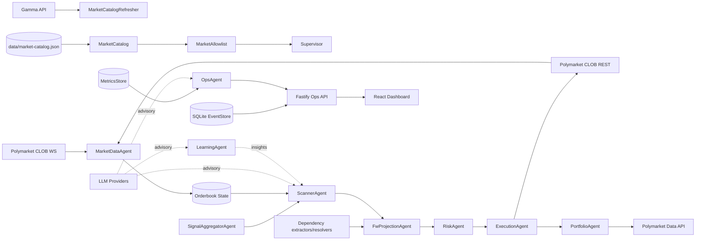

# OpenPolyTrader Knowledge Base

**Generated:** 2026-03-10
**Commit:** edd21e2
**Branch:** codex/deslopify
**Version:** 0.1.0

---

## 📋 Navigation

- [Overview](#overview)
- [Strategy Snapshot](#strategy-snapshot)
- [Project Structure](#project-structure)
- [Where to Look](#where-to-look)
- [Complexity Hotspots](#complexity-hotspots)
- [Agent Flow](#agent-flow)
- [Architecture Diagrams](#architecture-diagrams)
- [Documentation Index](#documentation-index)
- [Anti-Patterns](#anti-patterns)
- [Conventions](#conventions)
- [Commands](#commands)
- [API Endpoints](#api-endpoints)
- [Key Dependencies](#key-dependencies)
- [Notes](#notes)

---

## Overview

Near-zero-risk Polymarket CLOB arbitrage bot. TypeScript + Fastify backend, React dashboard. Agent-based architecture with event-sourced state.

**Current Snapshot:**
- 185 backend TypeScript source files under `src/`
- 52 dashboard TypeScript/TSX source files under `dashboard/src/`
- 144 backend unit suites under `tests/unit/`
- 5 Playwright specs under `dashboard/tests/e2e/`
- >97% coverage thresholds enforced in `vitest.config.ts`

---

## Strategy Snapshot

Core runtime strategies and their unique characteristics:

| Strategy | Unique behavior | Main control surfaces |
|------|----------|-------|
| `near_zero` | Paired YES/NO arbitrage with the strictest two-leg safety posture. | `strategyMode`, `signalMode`, `edgeRequired`, `minPairedFillRate`, `maxLegSkewMs` |
| `ev` | Single-sided directional execution with confidence thresholds, cooldown, and EV notional caps. | `signalMode`, `evEdgeRequired`, `evConfidenceMin`, `evCooldownSeconds`, `evMaxPerMarketNotional`, `evMaxPortfolioNotional` |
| `fw_projection` | Dependency-aware Frank-Wolfe projection; non-converged or non-feasible outputs are rejected. | `fwDependency*`, `fwGapAbsTolerance`, `fwGapRelTolerance`, `fwMaxLoopRuntimeMs`, `fwMinEdgeThreshold` |
| `fw_basket` | Multi-market FW basket intents with bounded basket size and configurable execution mode. | `fwBasketExecutionMode`, `fwBasketMinMarkets`, `fwBasketMaxMarkets`, `fwMaxPerMarketNotional`, `fwMaxPortfolioNotional` |

Ops labels normalize strategy output to: `near_zero`, `ev`, `fw_projection`, `fw_basket`.

---

## Project Structure

```
openpolytrader/
├── src/
│   ├── agents/        # Runtime agents + dependency/projection helpers
│   │   ├── dependency/   # Dependency extraction/resolution
│   │   ├── execution/    # Order execution runners + support modules
│   │   ├── learning/     # Advisory insight generation
│   │   ├── market-data/  # WS/REST book ingestion + metrics
│   │   ├── ops/          # SLO checks + ops telemetry
│   │   ├── portfolio/    # Positions, reconciliation, anomalies
│   │   ├── projection/   # Frank-Wolfe projection + basket shaping
│   │   ├── risk/         # Risk review + sizing
│   │   ├── scanner/      # Opportunity detection + scoring
│   │   └── signal/       # Web-search and signal aggregation
│   ├── api/           # Fastify route contracts, session, and handlers
│   ├── boot/          # Runtime assembly and startup lifecycle
│   ├── config/        # Env loaders, policy/risk, RPC, profiles, schema
│   ├── core/          # Supervisor, MessageBus, EventStore, lifecycle infra
│   ├── db/            # SQLite schema + migrations
│   ├── domain/        # Pure business rules, types, gate support, math
│   ├── security/      # Auth helpers and secret handling
│   ├── services/      # Polymarket, market catalog, LLM, web-search, sidecars
│   ├── telemetry/     # Metrics, event streams, SLO reporting
│   ├── tools/         # CLI entrypoints and prestart tooling
│   ├── utils/         # Shared helpers
│   ├── venues/        # VenueAdapter abstractions
│   └── main.ts        # Main runtime entrypoint
├── dashboard/         # React/Vite ops dashboard
│   ├── src/
│   │   ├── components/  # Shared ops/public UI primitives
│   │   ├── hooks/       # Shared runtime hooks
│   │   ├── lib/         # Client/runtime helpers
│   │   ├── pages/       # Ops/public pages + feature folders
│   │   ├── routes/      # Router layouts, auth views, controller hooks
│   │   └── styles/      # Tokens + split app/ops/public stylesheets
│   └── tests/e2e/       # Playwright smoke + flow coverage
├── tests/             # Vitest unit tests + shared fixtures
│   ├── unit/            # Backend + dashboard unit suites
│   └── fixtures/        # Test fixtures
├── docs/              # Comprehensive documentation
│   ├── ARCHITECTURE.md
│   ├── Development/
│   │   ├── setup.md
│   │   ├── market-catalog.md
│   │   └── architecture-decisions.md
│   ├── Operations/
│   │   ├── runbook.md
│   │   ├── config-knobs.md
│   │   ├── security.md
│   │   └── README.md
│   └── Testing/
│       └── strategy.md
├── scripts/           # Dev scripts (dev-up.sh, dev-down.sh)
├── data/              # SQLite database, market catalog
├── settings/          # Risk profile persistence
└── tmp/               # Logs during dev:ops
```

---

## Where to Look

| Task | Location | Notes |
|------|----------|-------|
| **Trading logic** | `src/agents/execution/` | Execution runners, timeouts, unwinds, idempotency |
| **Risk gates** | `src/domain/gates.ts` | Pre-trade validation (edge, depth, staleness) |
| **Portfolio state** | `src/agents/portfolio/` | Positions, PnL, reconciliation, anomaly detection |
| **FW projection** | `src/agents/projection/` | Dependency-aware projection opportunities before risk gating |
| **Market scanning** | `src/agents/scanner/` | Opportunity detection |
| **Signal aggregation** | `src/agents/signal/` | EV signal aggregation + web search |
| **Runtime assembly** | `src/boot/` | Startup wiring, lifecycle, and service composition |
| **API routes** | `src/api/` | Fastify handlers, contracts, and sessions |
| **API clients** | `src/services/` | PolymarketClob, PolymarketRealtime, PolymarketDataApi |
| **Configuration** | `src/config/` | Split env loaders, policy/risk, RPC, schema/store |
| **Event bus** | `src/core/MessageBus.ts` | Typed agent communication |
| **Persistence** | `src/core/EventStore.ts` | SQLite event sourcing |
| **Orchestration** | `src/core/Supervisor.ts` | Agent lifecycle, routing, circuit breakers |
| **Dashboard UI** | `dashboard/src/` | Public pages, ops views, routes, styles |
| **Risk config UI** | `dashboard/src/pages/risk-gates/` | Risk config sections + controller hook |
| **Tests** | `tests/unit/`, `dashboard/tests/e2e/` | Unit suites plus browser smoke/flow coverage |

---

## Complexity Hotspots

| File | Lines | Bytes | Why |
|------|-------|-------|-----|
| `tests/unit/execution.test.ts` | 3174 | 112885 | Comprehensive execution state-machine coverage |
| `tests/unit/execution-helper-runners.test.ts` | 2502 | 82316 | Split execution runners and timeout paths |
| `tests/unit/llm-services.test.ts` | 2320 | 81999 | Provider routing, retries, auth, and logging cases |
| `tests/unit/api-config.test.ts` | 2158 | 72467 | Ops API/config surface and schema coverage |
| `tests/unit/market-catalog-generator.test.ts` | 1899 | 59059 | Catalog generation edge cases and CLI flow |
| `tests/unit/market-catalog-refresher.test.ts` | 1780 | 52111 | Catalog refresh lifecycle and failure handling |
| `src/core/Supervisor.ts` | 1361 | 46035 | Runtime orchestration, routing, and circuit breakers |

---

## Agent Flow

```
SignalAggregatorAgent → ScannerAgent → (optional) FwProjectionAgent → RiskAgent → ExecutionAgent → PortfolioAgent
```

**Event Flow:**
```
market:updated → opportunity:detected → fw_projection (optional) → risk:approved → execution_lifecycle → execution:fill
```

---

## Architecture Diagrams

### System Architecture



### Decision and Trade Flow

```mermaid
flowchart TD
  MarketUpdate[Market update (WS/REST)] --> ScannerAgent
  ScannerAgent --> Opportunity[Arbitrage opportunity]
  Opportunity --> FwProjection[Optional FW projection]
  FwProjection --> Gates[evaluateGates]
  Gates -->|pass| RiskAgent
  Gates -->|fail| GateReject[gate_rejection metric]
  RiskAgent --> ExecutionAgent
  ExecutionAgent --> Orders[Place orders]
  Orders --> PortfolioAgent
  PortfolioAgent --> EventStore
  OpsAgent --> OpsApi
  OpsApi --> Dashboard

  LLMs[LLM advisory] -. scoring/summary .-> ScannerAgent
  LLMs -. health summary .-> OpsAgent
```

---

## Documentation Index

### 📖 Core Documentation

| Document | Purpose |
|----------|---------|
| [`README.md`](README.md) | Project overview, quickstart, API reference |
| [`CONTRIBUTING.md`](CONTRIBUTING.md) | Development setup, coding standards, PR process |
| [`agents.md`](agents.md) | This file - comprehensive project knowledge |

### 🏗️ Architecture & Design

| Document | Purpose |
|----------|---------|
| [`docs/ARCHITECTURE.md`](docs/ARCHITECTURE.md) | System architecture, agent details, data flow |
| [`docs/ARCHITECTURE_EVENT_FLOW.asc`](docs/ARCHITECTURE_EVENT_FLOW.asc) | ASCII end-to-end event flow diagram |
| [`docs/SEARCH_PROVIDER_ROUTING_TECHNICAL_SPEC.md`](docs/SEARCH_PROVIDER_ROUTING_TECHNICAL_SPEC.md) | Detailed EV web-search routing and provider-selection contract |
| [`docs/Development/architecture-decisions.md`](docs/Development/architecture-decisions.md) | ADRs for key architectural choices |

### 💻 Development

| Document | Purpose |
|----------|---------|
| [`docs/Development/setup.md`](docs/Development/setup.md) | Dev environment setup |
| [`docs/Development/commands.md`](docs/Development/commands.md) | Complete CLI command reference |
| [`docs/Development/market-catalog.md`](docs/Development/market-catalog.md) | Market catalog generation |
| [`docs/API.md`](docs/API.md) | Full Ops API reference |

### 🔧 Operations

| Document | Purpose |
|----------|---------|
| [`docs/Operations/environment-reference.md`](docs/Operations/environment-reference.md) | Minimum requirements + complete env var inventory |
| [`docs/Operations/runbook.md`](docs/Operations/runbook.md) | Operational guidance, health checks |
| [`docs/Operations/config-knobs.md`](docs/Operations/config-knobs.md) | Configuration reference |
| [`docs/Operations/security.md`](docs/Operations/security.md) | Security procedures |
| [`docs/Operations/README.md`](docs/Operations/README.md) | Operations documentation index |

### 🧪 Testing

| Document | Purpose |
|----------|---------|
| [`docs/Testing/strategy.md`](docs/Testing/strategy.md) | Test strategy and coverage |

### 📚 Local AGENTS.md Files

Local context files throughout the codebase:
- `agents.md` - repo-root knowledge base and operating rules
- `.github/AGENTS.md` - CI workflow guidance
- `src/AGENTS.md` - Source code overview
- `src/agents/AGENTS.md` - Agent architecture
- `src/agents/dependency/AGENTS.md` - FW dependency extraction/resolution
- `src/agents/execution/AGENTS.md` - Execution runners and safety rules
- `src/agents/learning/AGENTS.md` - Learning insight generation
- `src/agents/market-data/AGENTS.md` - Order book ingestion and normalization
- `src/agents/ops/AGENTS.md` - SLO/ops checks
- `src/agents/portfolio/AGENTS.md` - Portfolio reconciliation
- `src/agents/projection/AGENTS.md` - FW projection loop and basket shaping
- `src/agents/projection/fw/AGENTS.md` - FW math primitives
- `src/agents/risk/AGENTS.md` - Risk evaluation
- `src/agents/scanner/AGENTS.md` - Scanner scoring and event contracts
- `src/agents/signal/AGENTS.md` - Signal aggregation and web-search guidance
- `src/api/AGENTS.md` - API route and session guidance
- `src/config/AGENTS.md` - Config/env guidance
- `src/core/AGENTS.md` - Core systems
- `src/db/AGENTS.md` - Schema + migration guidance
- `src/db/migrations/AGENTS.md` - Migration-only rules
- `src/domain/AGENTS.md` - Domain-layer rules
- `src/security/AGENTS.md` - Auth/secret handling
- `src/services/AGENTS.md` - Backend service clients
- `src/services/llm/AGENTS.md` - LLM integration
- `src/services/ip-oracle/AGENTS.md` - IP oracle client contract
- `src/services/websearch/AGENTS.md` - Web-search provider rules
- `src/telemetry/AGENTS.md` - Metrics/event stream guidance
- `src/tools/AGENTS.md` - CLI tooling rules
- `src/utils/AGENTS.md` - Shared helper rules
- `src/venues/AGENTS.md` - Venue abstraction rules
- `dashboard/AGENTS.md` - Dashboard umbrella guidance
- `docs/AGENTS.md` - Documentation maintenance rules
- `services/AGENTS.md` - Sidecar service guidance
- `settings/AGENTS.md` - Risk profile persistence guidance
- `dashboard/src/AGENTS.md` - Dashboard overview
- `dashboard/src/components/AGENTS.md` - Shared UI primitives
- `dashboard/src/routes/AGENTS.md` - Dashboard route composition
- `dashboard/src/hooks/AGENTS.md` - Shared hook guidance
- `dashboard/src/lib/AGENTS.md` - Dashboard client/helper guidance
- `dashboard/src/pages/AGENTS.md` - Dashboard page guidance
- `dashboard/src/styles/AGENTS.md` - Styling/token guidance
- `dashboard/src/components/public/AGENTS.md` - Public UI components
- `dashboard/src/pages/public/AGENTS.md` - Public route pages
- `dashboard/public/AGENTS.md` - Static dashboard assets
- `dashboard/scripts/AGENTS.md` - Dashboard script guidance
- `dashboard/tests/AGENTS.md` - Dashboard test guidance
- `dashboard/tests/e2e/AGENTS.md` - Playwright suite guidance
- `tests/AGENTS.md` - Test umbrella guidance
- `tests/unit/AGENTS.md` - Testing patterns
- `tests/fixtures/AGENTS.md` - Shared test fixture constraints
- `tests/fixtures/llm/AGENTS.md` - LLM fixture payload constraints

---

## Anti-Patterns (THIS PROJECT)

### 🛡️ Risk Management - NEVER

- Accept inventory risk by design
- Retry failed orders without fresh book check (single-shot policy)
- Exceed position size limits or depth caps
- Assume atomic multi-leg execution
- Trade without explicit enable + kill-switches

### 🔒 Security - NEVER

- Commit secrets, .env files, API keys
- Include secrets in logs or telemetry
- Put API keys in RPC URLs (use base URL only)

### 💻 Development - NEVER

- Mix unrelated changes in commits
- Use `as any`, `@ts-ignore`, `@ts-expect-error`
- Guess - mark uncertainties as UNCONFIRMED
- Mock internal runtime systems in broad end-to-end tests without justification

### ⚙️ Operations - ALWAYS

- Fetch current `tick_size` from `/book` before placing orders
- Check `asks` array for actual execution prices
- Handle timeouts deterministically to avoid duplicate orders

---

## Conventions

### TypeScript

- **Target:** ES2022, NodeNext modules, strict mode
- **Module system:** ESM (`"type": "module"`)
- **Data structures:** Interfaces
- **Stateful services:** Classes
- **Runtime validation:** Zod
- **Unused variables:** Prefix with `_`

### Architecture

- **Pattern:** Agent-based (Scanner → optional FW projection → Risk → Execution → Portfolio)
- **State management:** Event-sourced (not direct mutation)
- **Communication:** MessageBus for inter-agent
- **Exchange abstraction:** VenueAdapter
- **Dependency injection:** Constructor DI with optional defaults

### Naming

- **Internal code:** camelCase
- **External API fields:** snake_case
- **Tests:** `*.test.ts` for Vitest suites, `*.spec.ts` for e2e

### Testing

- **Framework:** Vitest
- **Coverage:** >97% requirement
- **Mocking:** `vi.mock()` for external dependencies
- **Cleanup:** `afterEach` for deterministic test cleanup

---

## Commands

### Backend

```bash
npm run help             # root command/tool/flag reference
npm run h                # alias for help
npm run postinstall      # arch guard for local esbuild binaries
npm run dev              # tsx src/main.ts
npm run dev:ops          # backend + dashboard (scripts/dev-up.sh)
npm run dev:up           # alias for dev:ops
npm run dev:ops:status   # check oracle/backend/dashboard health
npm run dev:ops:down     # stop dev:ops processes
npm run dev:ops:smoke    # deterministic lifecycle smoke (up -> status -> down -> status)
npm run paper:up         # alias for dev:ops
npm run paper:status     # alias for dev:ops:status
npm run paper:down       # alias for dev:ops:down
npm run paper:smoke      # alias for dev:ops:smoke
npm run dev:live         # Docker backend + local dashboard dev server
npm run dev:live:down    # Stop Docker backend
npm run build            # tsc compilation
npm run build:all        # build backend + dashboard + Docker images
npm run build:all:up     # build everything and start Docker containers
npm run build:all:live   # build everything and start backend + dashboard dev server
npm run prestart         # market-catalog preflight before start
npm run start            # node dist/main.js
npm run lint             # eslint --max-warnings=0
npm run typecheck        # tsc --noEmit
npm run test             # vitest run
npm run test:coverage    # >97% thresholds
npm run polymarket:check # Polymarket connectivity smoke check
npm run polymarket:authcheck # Polymarket auth validation
npm run polymarket:derive-creds # derive CLOB creds from L1 key
npm run llm:smoke        # LLM routing smoke test
npm run catalog:refresh  # refresh market catalog
npm run catalog:refresh:dev -- --help # show market catalog generator CLI help
npm run catalog:relations # build dependency relation catalog
npm run catalog:relations:dev # run dependency relation catalog via tsx
```

### Dashboard

```bash
cd dashboard
npm run dev              # Vite dev server :5173 (dev:ops uses 5174)
npm run build            # Production build
npm run test:e2e         # Playwright
```

### Docker

```bash
docker compose up        # Local deployment
```

---

## API Endpoints

Base: `http://localhost:3000`

Reference: [`docs/API.md`](docs/API.md)

| Endpoint | Description |
|----------|-------------|
| `GET /health` | Health check |
| `GET /health/live` | Liveness probe (Docker) |
| `GET /health/ready` | Readiness probe (503 if degraded) |
| `GET /metrics` | JSON metrics snapshot (`counts` + `lastEventAt`) |
| `GET /slo` | Service Level Objectives |
| `GET /allowlist` | Market allowlist state |
| `GET /markets` | Allowlist entries enriched with market metadata |
| `GET /incidents` | Incident log |
| `GET /portfolio` | Portfolio snapshot |
| `GET /decisions` | Decision history query |
| `GET /stream` | SSE real-time events |
| `GET /config` | Configuration snapshot |
| `GET /config/schema` | Runtime editable policy/risk schema |
| `GET /config/infra` | Infra config snapshot (read-only) |
| `GET /config/risk-profiles` | Active + available risk profiles |
| `PATCH /config/policy` | Update trade policy |
| `PATCH /config/risk` | Update risk settings |
| `POST /config/risk-profile` | Apply risk profile |
| `POST /config/trading-mode` | Change trading mode/enabled state |
| `POST /allowlist/:marketId/resume` | Resume quarantined market |

Auth: `Authorization: Bearer $OPS_API_TOKEN`

---

## Key Dependencies

| Package | Purpose |
|---------|---------|
| **fastify** | API server |
| **ethers** | Polygon blockchain |
| **better-sqlite3** | Event store |
| **ws** | WebSocket client |
| **zod** | Schema validation |
| **react** | Dashboard UI |
| **vitest** | Testing framework |
| **playwright** | E2E testing |

---

## Notes

### Configuration

- Dashboard auth: use runtime `/ops/*` session login with `OPS_API_TOKEN` (no build-time token)
- Defaults in `.env.example`: `TRADING_ENABLED=true`, `TRADING_MODE=shadow`, `RISK_PROFILE=extra_high`
- To hard-disable trading: set `TRADING_ENABLED=false` or `TRADING_MODE=off`
- Market catalog: Optional `MARKET_CATALOG_PATH` JSON array

### Development

- Local GitHub Actions workflow present at `.github/workflows/ci.yml`
- Logs during `dev:ops`: `tmp/backend.log`, `tmp/dashboard.log`
- SQLite database: `data/openpolytrader.db`
- Risk profiles persisted to: `settings/risk-gates/active.json`

### Safety

- Near-zero-risk live mode requires user channel connectivity
- All LLM interactions are strictly advisory (no autonomous trading)
- Circuit breakers protect against cascade failures
- Automatic market quarantine after incidents

---

<p align="center">
  <strong>OpenPolyTrader</strong> - Near-zero-risk arbitrage automation
</p>

<!-- desloppify-begin -->
<!-- desloppify-skill-version: 3 -->
---
name: desloppify
description: >
  Codebase health scanner and technical debt tracker. Use when the user asks
  about code quality, technical debt, dead code, large files, god classes,
  duplicate functions, code smells, naming issues, import cycles, or coupling
  problems. Also use when asked for a health score, what to fix next, or to
  create a cleanup plan. Supports 28 languages.
allowed-tools: Bash(desloppify *)
---

# Desloppify

## 1. Your Job

Maximise the **strict score** honestly. Your main cycle: **scan → plan → execute → rescan**. Follow the scan output's **INSTRUCTIONS FOR AGENTS** — don't substitute your own analysis.

**Don't be lazy.** Do large refactors and small detailed fixes with equal energy. If it takes touching 20 files, touch 20 files. If it's a one-line change, make it. No task is too big or too small — fix things properly, not minimally.

## 2. The Workflow

Three phases, repeated as a cycle.

### Phase 1: Scan and review — understand the codebase

```bash
desloppify scan --path .       # analyse the codebase
desloppify status              # check scores — are we at target?
```

The scan will tell you if subjective dimensions need review. Follow its instructions. To trigger a review manually:
```bash
desloppify review --prepare    # then follow your runner's review workflow
```

### Phase 2: Plan — decide what to work on

After reviews, triage stages and plan creation appear as queue items in `next`. Complete them in order:
```bash
desloppify next                                        # shows the next workflow step
desloppify plan triage --stage observe --report "themes and root causes..."
desloppify plan triage --stage reflect --report "comparison against completed work..."
desloppify plan triage --stage organize --report "summary of priorities..."
desloppify plan triage --complete --strategy "execution plan..."
```

Then shape the queue. **The plan shapes everything `next` gives you** — don't skip this step.

```bash
desloppify plan                          # see the full ordered queue
desloppify plan reorder <pat> top        # reorder — what unblocks the most?
desloppify plan cluster create <name>    # group related issues to batch-fix
desloppify plan focus <cluster>          # scope next to one cluster
desloppify plan skip <pat>              # defer — hide from next
```

More plan commands:
```bash
desloppify plan reorder <cluster> top    # move all cluster members at once
desloppify plan reorder <a> <b> top     # mix clusters + findings in one reorder
desloppify plan reorder <pat> before -t X  # position relative to another item/cluster
desloppify plan cluster reorder a,b top # reorder multiple clusters as one block
desloppify plan resolve <pat>           # mark complete
desloppify plan reopen <pat>             # reopen
```

### Phase 3: Execute — grind the queue to completion

Trust the plan and execute. Don't rescan mid-queue — finish the queue first.

**Branch first.** Create a dedicated branch for health work — never commit directly to main:
```bash
git checkout -b desloppify/code-health    # or desloppify/<focus-area>
```

**Set up commit tracking.** If you have a PR, link it for auto-updated descriptions:
```bash
desloppify config set commit_pr 42        # PR number for auto-updates
```

**The loop:**
```
1. desloppify next              ← what to fix next
2. Fix the issue in code
3. Resolve it (next shows you the exact command including required attestation)
4. When you have a logical batch, commit:
   git add <files> && git commit -m "desloppify: fix 3 deferred_import findings"
5. Record the commit:
   desloppify plan commit-log record      # moves findings uncommitted → committed, updates PR
6. Push periodically:
   git push -u origin desloppify/code-health
7. Repeat until the queue is empty
```

Score may temporarily drop after fixes — cascade effects are normal, keep going.
If `next` suggests an auto-fixer, run `desloppify autofix <fixer> --dry-run` to preview, then apply.

**When the queue is clear, go back to Phase 1.** New issues will surface, cascades will have resolved, priorities will have shifted. This is the cycle.

### Other useful commands

```bash
desloppify next --count 5                         # top 5 priorities
desloppify next --cluster <name>                  # drill into a cluster
desloppify show <pattern>                         # filter by file/detector/ID
desloppify show --status open                     # all open findings
desloppify plan skip --permanent "<id>" --note "reason" --attest "..." # accept debt
desloppify exclude <path>                         # exclude a directory from scanning
desloppify config show                            # show all config including excludes
desloppify scan --path . --reset-subjective       # reset subjective baseline to 0
```

## 3. Reference

### How scoring works

Overall score = **40% mechanical** + **60% subjective**.

- **Mechanical (40%)**: auto-detected issues — duplication, dead code, smells, unused imports, security. Fixed by changing code and rescanning.
- **Subjective (60%)**: design quality review — naming, error handling, abstractions, clarity. Starts at **0%** until reviewed. The scan will prompt you when a review is needed.
- **Strict score** is the north star: wontfix items count as open. The gap between overall and strict is your wontfix debt.
- **Score types**: overall (lenient), strict (wontfix counts), objective (mechanical only), verified (confirmed fixes only).

### Subjective reviews in detail

- **Local runner (Codex)**: `desloppify review --run-batches --runner codex --parallel --scan-after-import` — automated end-to-end.
- **Local runner (Claude)**: `desloppify review --prepare` → launch parallel subagents → `desloppify review --import merged.json` — see skill doc overlay for details.
- **Cloud/external**: `desloppify review --external-start --external-runner claude` → follow session template → `--external-submit`.
- **Manual path**: `desloppify review --prepare` → review per dimension → `desloppify review --import file.json`.
- Import first, fix after — import creates tracked state entries for correlation.
- Target-matching scores trigger auto-reset to prevent gaming.
- Even moderate scores (60-80) dramatically improve overall health.
- Stale dimensions auto-surface in `next` — just follow the queue.

### Review output format

Return machine-readable JSON for review imports. For `--external-submit`, include `session` from the generated template:

```json
{
  "session": {
    "id": "<session_id_from_template>",
    "token": "<session_token_from_template>"
  },
  "assessments": {
    "<dimension_from_query>": 0
  },
  "findings": [
    {
      "dimension": "<dimension_from_query>",
      "identifier": "short_id",
      "summary": "one-line defect summary",
      "related_files": ["relative/path/to/file.py"],
      "evidence": ["specific code observation"],
      "suggestion": "concrete fix recommendation",
      "confidence": "high|medium|low"
    }
  ]
}
```

**Import rules:**
- `findings` MUST match `query.system_prompt` exactly (including `related_files`, `evidence`, and `suggestion`). Use `"findings": []` when no defects found.
- Import is fail-closed: invalid findings abort unless `--allow-partial` is passed.
- Assessment scores are auto-applied from trusted internal or cloud session imports. Legacy `--attested-external` remains supported.

**Import paths:**
- Robust session flow (recommended): `desloppify review --external-start --external-runner claude` → use generated prompt/template → run printed `--external-submit` command.
- Durable scored import (legacy): `desloppify review --import findings.json --attested-external --attest "I validated this review was completed without awareness of overall score and is unbiased."`
- Findings-only fallback: `desloppify review --import findings.json`

### Review integrity

1. Do not use prior chat context, score history, or target-threshold anchoring.
2. Score from evidence only; when mixed, score lower and explain uncertainty.
3. Assess every requested dimension; never drop one. If evidence is weak, score lower.

### Reviewer agent prompt

Runners that support agent definitions (Cursor, Copilot, Gemini) can create a dedicated reviewer agent. Use this system prompt:

```
You are a code quality reviewer. You will be given a codebase path, a set of
dimensions to score, and what each dimension means. Read the code, score each
dimension 0-100 from evidence only, and return JSON in the required format.
Do not anchor to target thresholds. When evidence is mixed, score lower and
explain uncertainty.
```

See your editor's overlay section below for the agent config format.

### Commit tracking & branch workflow

Work on a dedicated branch named `desloppify/<description>` (e.g., `desloppify/code-health`, `desloppify/fix-smells`). Never push health work directly to main.

```bash
desloppify config set commit_pr 42              # link to your PR
desloppify plan commit-log                      # see uncommitted + committed status
desloppify plan commit-log record               # record HEAD commit, update PR description
desloppify plan commit-log record --note "why"  # with rationale
desloppify plan commit-log record --only "smells::*"  # record specific findings only
desloppify plan commit-log history              # show commit records
desloppify plan commit-log pr                   # preview PR body markdown
desloppify config set commit_tracking_enabled false  # disable guidance
```

After resolving findings as `fixed`, the tool shows uncommitted work, committed history, and a suggested commit message. After committing externally, run `record` to move findings from uncommitted to committed and auto-update the linked PR description.

### Key concepts

- **Tiers**: T1 auto-fix → T2 quick manual → T3 judgment call → T4 major refactor.
- **Auto-clusters**: related findings are auto-grouped in `next`. Drill in with `next --cluster <name>`.
- **Zones**: production/script (scored), test/config/generated/vendor (not scored). Fix with `zone set`.
- **Wontfix cost**: widens the lenient↔strict gap. Challenge past decisions when the gap grows.
- Score can temporarily drop after fixes (cascade effects are normal).

## 4. Escalate Tool Issues Upstream

When desloppify itself appears wrong or inconsistent:

1. Capture a minimal repro (`command`, `path`, `expected`, `actual`).
2. Open a GitHub issue in `peteromallet/desloppify`.
3. If you can fix it safely, open a PR linked to that issue.
4. If unsure whether it is tool bug vs user workflow, issue first, PR second.

## Prerequisite

`command -v desloppify >/dev/null 2>&1 && echo "desloppify: installed" || echo "NOT INSTALLED — run: pip install --upgrade git+https://github.com/peteromallet/desloppify.git"`

<!-- desloppify-end -->

## Codex Overlay

This is the canonical Codex overlay used by the README install command.

1. Prefer first-class batch runs: `desloppify review --run-batches --runner codex --parallel --scan-after-import`.
2. The command writes immutable packet snapshots under `.desloppify/review_packets/holistic_packet_*.json`; use those for reproducible retries.
3. Keep reviewer input scoped to the immutable packet and the source files named in each batch.
4. If a batch fails, retry only that slice with `desloppify review --run-batches --packet <packet.json> --only-batches <idxs>`.
5. Manual override is safety-scoped: you cannot combine it with `--allow-partial`, and provisional manual scores expire on the next `scan` unless replaced by trusted internal or attested-external imports.

<!-- desloppify-overlay: codex -->
<!-- desloppify-end -->
