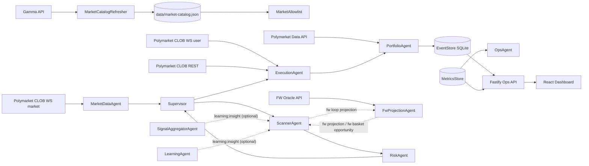

# OpenPolyTrader Architecture

This document reflects the current runtime architecture in `src/` and the active ops/dashboard surfaces.

## Scope

- Trading engine: TypeScript backend (`src/`)
- Ops API: Fastify server (`src/api/server.ts`)
- Dashboard: React + Vite (`dashboard/src/`)
- Persistence: SQLite event store (`src/core/EventStore.ts`)

## Strategy Matrix (Read First)

Runtime strategy labels and their distinguishing execution traits:

| Strategy label | Pipeline shape | Distinguishing traits | Main policy surfaces |
| --- | --- | --- | --- |
| `near_zero` | `Scanner -> Risk -> Execution` | Paired YES/NO arbitrage with strict two-leg safety gates and near-zero-risk defaults | `strategyMode`, `signalMode`, `edgeRequired`, `minPairedFillRate`, `maxLegSkewMs` |
| `ev` | `SignalAggregator/Scanner -> Risk -> Execution` | Single-sided directional execution (`side=yes|no`) with confidence, cooldown, and EV notional limits | `signalMode`, `evEdgeRequired`, `evConfidenceMin`, `evCooldownSeconds`, `evMaxPerMarketNotional`, `evMaxPortfolioNotional` |
| `fw_projection` | `Scanner -> FwProjectionAgent -> Risk -> Execution` | Dependency-aware FW solver output; non-converged or non-feasible projection results are rejected | `fwDependency*`, `fwGapAbsTolerance`, `fwGapRelTolerance`, `fwMaxLoopRuntimeMs`, `fwMinEdgeThreshold` |
| `fw_basket` | `Scanner -> FwProjectionAgent -> Risk -> Execution` | Multi-market FW basket intents with configurable execution mode and basket size bounds | `fwBasketExecutionMode`, `fwBasketMinMarkets`, `fwBasketMaxMarkets`, `fwMaxPerMarketNotional`, `fwMaxPortfolioNotional` |

Operator-facing normalization:
- Dashboard labels normalize to `near_zero`, `ev`, `fw_projection`, `fw_basket`.
- `ev_single_side` is displayed as `ev`.
- Opportunity IDs can infer strategy when metadata is missing (`:fw:`, `:fwb:`, `:yes:`, `:no:`).

## System Topology



## Agent Responsibilities

| Agent | Responsibility | Key File |
| --- | --- | --- |
| `MarketDataAgent` | Maintains token orderbooks from WS + snapshot refresh | `src/agents/market-data/MarketDataAgent.ts` |
| `SignalAggregatorAgent` | Optional EV signal enrichment via web search + learning insights | `src/agents/signal/SignalAggregatorAgent.ts` |
| `ScannerAgent` | Detects candidate opportunities and applies gate checks | `src/agents/scanner/ScannerAgent.ts` |
| `FwProjectionAgent` | Runs the fully-corrective FW loop (active set + gap + contraction) and emits FW projection/basket opportunities | `src/agents/projection/FwProjectionAgent.ts` |
| `RiskAgent` | Calculates approval and position size constraints | `src/agents/risk/RiskAgent.ts` |
| `ExecutionAgent` | Places/cancels orders and manages paired + FW basket execution lifecycle | `src/agents/execution/ExecutionAgent.ts` |
| `PortfolioAgent` | Tracks positions/PnL and reconciliation | `src/agents/portfolio/PortfolioAgent.ts` |
| `OpsAgent` | Runs health/SLO checks and emits alerts | `src/agents/ops/OpsAgent.ts` |
| `LearningAgent` | Produces `learning:insight` messages for EV/scanner workflows | `src/agents/learning/LearningAgent.ts` |

## End-to-End Event Flow (ASCII / ASC)

The ASCII (`.asc`) architecture flow is maintained in:

- `docs/ARCHITECTURE_EVENT_FLOW.asc`

Inline version:

```text
[Gamma API] -------------------------> [MarketCatalogRefresher]
[Polymarket CLOB WS market channel] -> [MarketDataAgent]
[Polymarket CLOB WS user channel] ---> [ExecutionAgent]
[Polymarket CLOB REST] --------------> [ExecutionAgent]
[Polymarket Data API] ---------------> [PortfolioAgent]

MarketDataAgent --market:updated--> Supervisor -> ScannerAgent
SignalAggregatorAgent --learning:insight (optional)--> ScannerAgent
LearningAgent --learning:insight (optional)--> ScannerAgent
ScannerAgent --global fw loop--> FwProjectionAgent --> ScannerAgent
ScannerAgent --opportunity:detected--> Supervisor -> RiskAgent
RiskAgent --risk:approved--> Supervisor -> ExecutionAgent
ExecutionAgent --execution:fill--> PortfolioAgent
ExecutionAgent --execution:outcome--> MetricsStore/EventStore/Ops API
PortfolioAgent -> EventStore -> Ops API -> Dashboard
MetricsStore -> OpsAgent -> Ops API -> Dashboard
```

## Runtime Message-Bus Events

Common message-bus events emitted by runtime components:

- `market:updated`
- `opportunity:detected`
- `risk:approved`
- `execution:fill`
- `execution:outcome`
- `learning:insight`
- `ops:health`
- `ops:alert`
- `ops:health_summary`

## Execution Modes and Safety

- `TRADING_MODE=off|shadow|paper|live`
- `TRADING_ENABLED=true|false`
- Paper-mode startup contract: with `TRADING_MODE=paper` and `TRADING_ENABLED=true`, backend boot performs FW oracle `/health` preflight and fails fast when sidecar is unavailable.
- Recommended local paper orchestration: `npm run paper:up` / `npm run paper:status` / `npm run paper:down` (aliases for `dev:ops` scripts).
- Live mode requires strict key validation in `src/config/env.ts`.
- `POST /config/trading-mode` requires `?confirm=true` to switch to `live`.
- Near-zero mode is fail-closed when required live prerequisites are missing.

## Runtime Command Surface

- Full command inventory: `docs/Development/commands.md`
- Help: `npm run help` (`npm run h` alias)
- Core start paths:
  - `npm run dev` (backend only)
  - `npm run dev:ops` / `npm run dev:up` / `npm run paper:up` (oracle + backend + dashboard)
  - `npm run dev:live` (Docker backend + local dashboard)
  - `npm run start` (compiled runtime)
- Core stop/kill paths:
  - `npm run dev:ops:down` / `npm run paper:down` (includes escalation to `SIGKILL` and port cleanup when required)
  - `npm run dev:live:down` (Docker shutdown)
- Lifecycle smoke:
  - `npm run dev:ops:smoke` / `npm run paper:smoke`

## Persistence + Telemetry

- Event-sourced persistence: `src/core/EventStore.ts`
- In-memory metrics stream: `src/telemetry/metrics.ts`
- SLO aggregates computed from event store: `src/agents/ops/sloAggregates.ts`
- SSE stream available at `GET /stream`

## Dashboard Intent Semantics

The Ops Overview intent tables are fed by stream events:

- "All intents (gated)" rows are created from `latency` events where `stage=gated`.
- "Executed intents" rows are updated from `order` events.
- Strategy labels shown to operators are normalized to `near_zero`, `ev`, `fw_projection`, and `fw_basket`.
  - `ev_single_side` is normalized to `ev`.
  - Opportunity-id hints are used when explicit strategy is missing (`:fw:`, `:fwb:`, `:yes:`, `:no:`).

## Ops and Control Plane

Ops API is implemented in `src/api/server.ts` and includes:

- Health/readiness/liveness
- Metrics and SLO endpoints
- Allowlist, markets, incidents, portfolio, decisions
- Runtime config and risk-profile updates
- Trading mode changes and debug endpoints

See `docs/API.md` for complete endpoint details.
