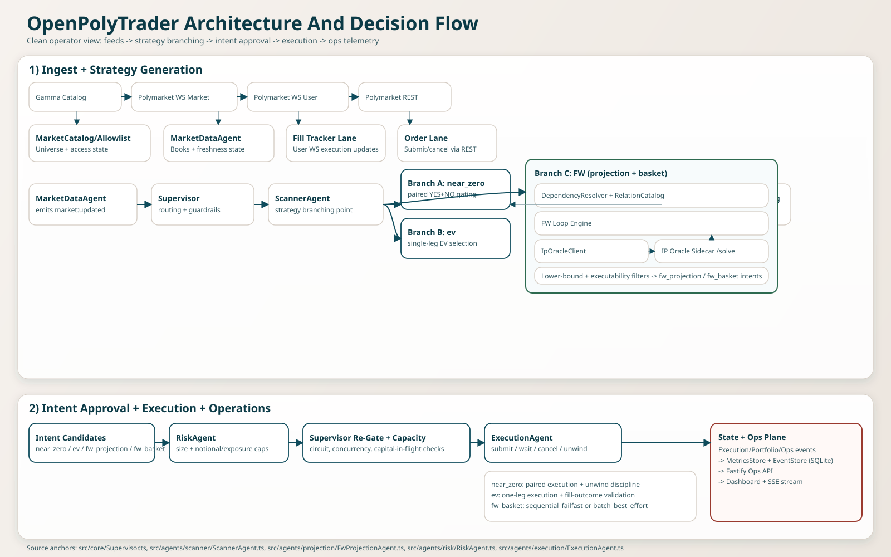

# OpenPolyTrader Operator Strategy Report

This report gives operators a practical, implementation-grounded guide for strategy selection, tuning, and incident triage.

## Executive Summary

OpenPolyTrader runs an event-driven pipeline where market updates are scanned into strategy intents (`near_zero`, `ev`, `fw_projection`, `fw_basket`), re-validated and sized by risk, then executed under strict safety controls. The most conservative operating path is `near_zero` in `paper` mode with strict depth/staleness gates. FW modes add dependency and solver infrastructure for broader opportunity search, but require tighter monitoring of resolver/oracle health and convergence telemetry.

## Architecture Snapshot

## Strategy Selection Cheat Sheet

| Strategy | Use It When | Avoid It When | Primary Controls |
| --- | --- | --- | --- |
| `near_zero` | You need strongest two-leg discipline and bounded posture for rollout/validation. | Books are frequently thin/stale or paired fill quality is poor. | `strategyMode`, `signalMode`, `edgeRequired`, `minPairedFillRate`, `maxLegSkewMs` |
| `ev` | You want directional intents with explicit confidence/cooldown controls. | Signal confidence quality is weak or one-sided inventory risk is unacceptable. | `signalMode`, `evEdgeRequired`, `evConfidenceMin`, `evCooldownSeconds`, `evMaxPerMarketNotional`, `evMaxPortfolioNotional` |
| `fw_projection` | You want dependency-aware single-market intent selection across a wider universe. | Resolver/oracle health is unstable or low-latency simplicity is preferred. | `fwDependency*`, `fwGapAbsTolerance`, `fwGapRelTolerance`, `fwMaxLoopRuntimeMs`, `fwMinEdgeThreshold` |
| `fw_basket` | You want multi-market FW exposure with basket shaping controls. | You are in early rollout or currently handling frequent execution incidents. | `fwBasketMinMarkets`, `fwBasketMaxMarkets`, `fwBasketExecutionMode`, `fwMaxPerMarketNotional`, `fwMaxPortfolioNotional` |

## Strategies (Newbie-Friendly)

### 1) `near_zero`

This is the safest default style: the bot tries to buy both YES and NO in the same market only when combined cost is below `$1` after fee/slippage assumptions. It proceeds only if market quality checks pass, including fresh books, sane spread, sufficient depth, tick alignment, and low leg skew. Risk sizing then sets position size, and execution sends two tightly coordinated orders. If one leg fails or partially fills, execution cancels/unwinds to prevent open directional risk.

### 2) `ev`

This is directional one-leg trading: the bot estimates `pFinal` from market prices and optional learned signal, chooses YES or NO, computes expected edge, and subtracts fee/slippage estimates. Confidence floors and cooldowns are enforced so noisy signals do not trigger overtrading. After risk sizing, including EV-specific notional caps, execution places one order and waits for fill outcome. Delayed, rejected, or timeout paths are treated as failures rather than silent success.

### 3) `fw_projection`

This is dependency-aware optimization across markets. Instead of scoring a market in isolation, it builds a dependency graph (`mutual_exclusive`, `implies`, `complementary`, `partition`), runs a Frank-Wolfe loop, and repeatedly calls the oracle solver for feasible binary assignments under those constraints. It then computes an executable lower bound (projected edge minus penalties for fees, slippage, staleness, stability, and execution risk). Only candidates above threshold with acceptable solver/quality status become intents.

### 4) `fw_basket`

This is the multi-market FW path. If FW returns multiple strong executable candidates, the bot can emit one basket intent with bounded market count and configured execution mode. `sequential_failfast` is stricter and stops quickly on failure; `batch_best_effort` can submit more broadly with fallback handling. Basket-level and market-level gates still apply, and FW-specific notional caps in risk sizing keep this path bounded.

## FW Infrastructure Reference

| Component | Role | Operational Impact |
| --- | --- | --- |
| IpOracle sidecar (`services/ip-oracle`) | Local Python FastAPI + OR-Tools CP-SAT service exposing `/solve` and `/health` for FW binary constrained optimization. | Core solver dependency for FW projection quality and feasibility checks. |
| `IpOracleClient` | TypeScript client calling sidecar with timeout, small retries, optional bearer auth, and circuit breaker (`failureThreshold`, `cooldownMs`). | Prevents repeated oracle failure storms from stalling the hot path. |
| `DependencyResolver` | Builds dependency edges in `deterministic`, `llm`, or `hybrid` mode with `consensus`/`union` merge rules. | Controls graph quality and hot-path stability through confidence caps, cache+grace, and backoff timers. |
| Dependency relation catalog (`data/dependency-relations.json`) | Prebuilt relation file merged into runtime edges during startup/refresh flows. | Improves deterministic startup behavior and reduces dependence on live extraction quality. |
| Startup guards | Paper mode with trading enabled fails fast when FW oracle health is unavailable; relation setup can fail closed when required catalog state is missing. | Enforces fail-closed behavior for critical FW dependencies before trading starts. |

### Oracle Health Operational Note

Common `dev:ops` log noise can come from Python interpreter candidate probing (`solver import failed`). The source of truth is sidecar health/status output. If `/health` is `200`, oracle is usable even when earlier interpreter probes were skipped.

### Clarification: Oracle CA / IP Resolver

Current implementation uses local sidecar HTTP with optional bearer auth and startup health preflight. A dedicated oracle CA or mTLS certificate-authority chain is not present in the current runtime path. The "IP oracle" in this codebase is the integer projection solver sidecar, not a public-IP discovery or PKI authority service.

## Risk Control Layers

| Layer | What It Controls | Typical Rejection Signals |
| --- | --- | --- |
| Gate checks | Price/edge/depth/staleness/slippage/tick quality before execution. | `gate_rejection` with depth/staleness/slippage reasons. |
| Strategy-specific gates | EV and FW add confidence, solver status, projection age, lower-bound edge, and dependency-confidence checks. | `ev_signal` and FW rejection reasons (`fw_solver_status`, stale/low-confidence, low lower bound). |
| Risk sizing | Position size via trade fraction, depth, unwind budget, drawdown/loss, exposure, EV/FW notional caps. | `risk` rejection reasons such as `market_exposure_limit`, `daily_loss_limit`, `fw_notional_cap`. |
| Supervisor runtime controls | Concurrent markets, capital in flight, circuit breaker states. | `gate_rejection` reasons like `max_concurrent_markets`, `capital_in_flight`, `circuit_breaker`. |
| Execution safety | Idempotency, timeout state machine, cancel/unwind handling, and hard checks on latency/OTR/velocity/delayed-ack/price-band. | `order` failures, execution incidents, partial fill unwind paths. |

## Speed And Intent-Latency Controls

| Control Surface | Purpose | Tuning Direction |
| --- | --- | --- |
| Deterministic-first scanner checks | Cheap deterministic checks run before expensive paths. | Keep deterministic path strict and stable as first filter. |
| FW scan coalescing (`fwScanMinIntervalMs`) | Prevents over-triggered FW scans on bursty market updates. | Increase interval for stability, decrease for responsiveness. |
| FW loop bounds (`fwMaxLoopRuntimeMs`, `fwMaxIterations`) | Hard limit on optimization work per loop. | Lower for predictable latency, raise for potentially better convergence. |
| Oracle limits (`fwOracleTimeLimitMs`, `fwOracleMaxConcurrency`) | Caps solve runtime and request fan-out pressure. | Lower on degraded sidecar; raise cautiously when sidecar healthy. |
| Resolver cache/backoff (`fwDependencyCache*`, `fwDependencyBackoff*`) | Prevents repeated slow/invalid extraction in hot path. | Enable conservative cache + backoff before hybrid rollout. |
| Prioritization bounds (`scoreTopN`, scoring concurrency) | Limits ranking/scoring work per decision batch. | Keep top-N and concurrency bounded to avoid decision lag spikes. |
| Execution timeouts (`submit`, `ack`, `fill`, `cancel`) | Forces fast-fail behavior instead of hanging transitions. | Keep explicit bounded timeouts; tune only with observed failure evidence. |
| Decision latency SLO (`maxDecisionLatencyMs`) | Enforces expected latency envelope for decision stages. | Keep strict in production-like paper runs. |

## Safest Tuning Order (Runbook Sequence)

1. Keep mode conservative: `shadow` first, then `paper`.
2. Set strict risk caps before any edge expansion: reduce EV/FW per-market and portfolio notional limits.
3. Tighten quality gates before increasing size: adjust edge and staleness/depth/slippage controls.
4. Stabilize FW with deterministic dependency mode first.
5. Expand FW scope gradually: small basket sizes, failfast mode, then wider baskets only after telemetry is stable.

## Metrics Symptoms And Triage

| Symptom In `/metrics` | Likely Cause | First Operator Action |
| --- | --- | --- |
| Rising `gate_rejection` with depth/staleness reasons | Books degraded or size/gates misaligned. | Reduce size expectations and tighten staleness/depth filters. |
| Frequent `ev_signal` cooldown/missing-signal reasons | Signal cadence/model input quality issues. | Increase cooldown conservatively and verify signal pipeline freshness. |
| `fw_dependency` fallback/backoff spikes | LLM extraction instability or cache misconfiguration. | Switch to `fwDependencyMode=deterministic` and verify cache/backoff controls. |
| `fw_oracle` timeout/error increase | Sidecar degraded or over-saturated. | Reduce `fwOracleTimeLimitMs`/concurrency, verify `/health`, restart sidecar stack. |
| High `fw_iteration` with poor `fw_gap` convergence | Loop budget/tolerance mismatch for current market set. | Lower universe pressure, tighten selection thresholds, adjust loop bounds. |
| `fw_basket` failures/partial outcomes | Leg executability mismatch in selected basket. | Lower `fwBasketMaxMarkets` and keep `sequential_failfast`. |
| Risk rejection dominance (`fw_notional_cap`, exposure caps) | Limits binding by design. | Keep limits or reduce upstream intent aggressiveness rather than forcing execution. |

## Architectural Decisions Reflected In Runtime

| Decision | Implementation Reflection |
| --- | --- |
| Agent-based architecture | Supervisor orchestrates specialized agents over typed message events. |
| Event-sourced observability | EventStore + MetricsStore provide replayable state and operator telemetry. |
| Layered gating model | Scanner pre-gates, Risk sizes, Supervisor re-checks with desired size immediately before execution. |
| Fail-closed startup for critical dependencies | Paper startup refuses trading when FW oracle and required relation setup are not ready. |
| Runtime policy separated from infra env | Trade policy/risk is runtime-editable while connectivity/infra remains env-only. |
| Near-zero-first safety posture | Conservative defaults, strict gates, and strong paired execution discipline. |
| LLM as bounded advisory layer | Deterministic controls remain authoritative; extraction/scoring bounded by mode/cache/backoff. |
| FW as bounded optimization service | Explicit runtime/iteration/concurrency/time limits plus startup health contracts. |

## File References

- Runtime strategy and metadata: `src/domain/opportunity.ts`
- Gate logic: `src/domain/gates.ts`
- Orchestration and runtime controls: `src/core/Supervisor.ts`
- Scanner and EV logic: `src/agents/scanner/ScannerAgent.ts`
- FW projection pipeline: `src/agents/projection/FwProjectionAgent.ts`
- FW loop math engine: `src/agents/projection/fw/FwLoopEngine.ts`
- Dependency resolver: `src/agents/dependency/DependencyResolver.ts`
- Oracle client: `src/services/ip-oracle/IpOracleClient.ts`
- Oracle sidecar: `services/ip-oracle/app.py`
