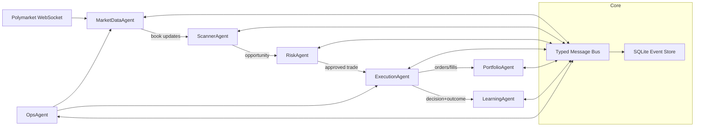
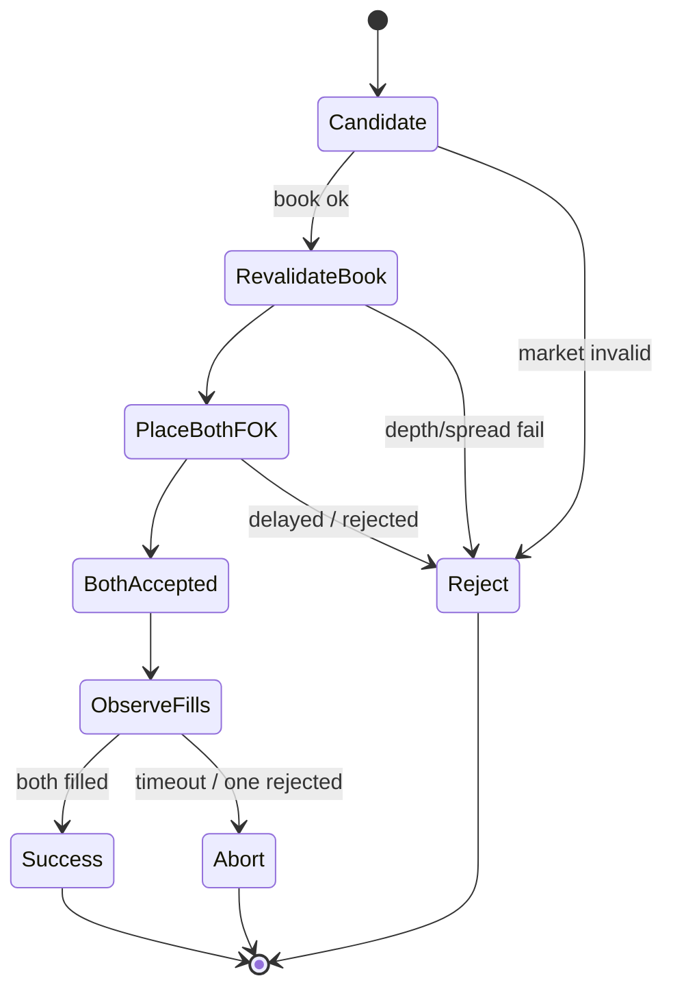

# Polymarket CLOB Arbitrage Bot (24/7, $1,000 cap) — Research Report

_Last updated: 2026-01-01_

> **Non-advice notice**: This document is technical research, not financial or legal advice. Prediction markets may be restricted in your jurisdiction. Automated trading may violate platform rules or local law.

---

## 0) Executive summary (what we will build + what we will NOT build)

### Goal
Build a **24/7 automation system** that searches for **near-risk-free** arbitrage opportunities on Polymarket and executes them, while:
- tracking **state**, **trades**, **fills**, and **decisions**;
- storing a **reasoning/decision log** for every action;
- learning from execution outcomes (timeouts, delays, slippage) using a **safe online learning loop**.

### Critical constraint: true “risk-free” requires atomic execution
A classic “complete set” arbitrage (buy YES + buy NO for < $1) is **risk-free only if you can guarantee both legs fill at the required prices/sizes**.

Polymarket CLOB provides:
- **FOK** (Fill-Or-Kill) orders: a single order fills entirely or cancels.
- **FAK** (Fill-And-Kill) orders: fills what it can immediately; cancels the rest.
- **Batch order placement** (up to 15 orders/request) — but **docs do not claim atomic multi-leg execution**.

**Implication:** Polymarket does not publish an “atomic multi-leg” primitive for CLOB orders. Therefore, **“perfectly risk-free two-leg execution” cannot be guaranteed in all conditions**. We can only:
1) **restrict** to markets/conditions where probability of simultaneous fills is extremely high,
2) **use FOK on both legs**,
3) **skip** when the exchange signals `delayed` / `ORDER_DELAYED`,
4) keep position sizing small and adaptively learn execution parameters.

### Narrowed recommended approach (Phase 1)
To avoid “cross-market/cross-provider” complexity, start with:
- **Single-venue only:** Polymarket CLOB.
- **Strict market filters:** exclude sports (3-second delay + orderbook clearing at game start) and thin markets.
- **Near-risk-free only gate:** trade only when depth and spread thresholds make both FOK legs very likely.

Phase 2 (optional): cross-venue with Kalshi etc. This is materially harder due to **contract equivalence** and **settlement mismatches**.

### Config block (draft for future implementation)

```yaml
# config.yaml (draft)
trading:
  target_trade_fraction: 0.10         # default target notional per attempt (% equity)
  max_trade_fraction: 0.10            # hard ceiling
  edge_required: 0.03                 # require p_yes + p_no <= 0.97 (conservative start)
  max_open_inventory_seconds: 2       # max time allowed with one-leg exposure

risk:
  max_attempt_loss_fraction: 0.0025   # 0.25% equity worst-case tolerated per failed attempt
  max_daily_drawdown_fraction: 0.02   # 2% daily drawdown -> pause
  market_cooldown_seconds: 600        # pause market after an incident (example)

execution:
  order_type_primary: FOK             # per-leg: no partial fills
  order_type_unwind: FAK              # unwind leg quickly if incident occurs
  reject_delayed: true                # treat status=delayed / ORDER_DELAYED as no-trade
  max_requotes: 0                     # 0 by default for risk-free-only posture
  incident_price_cap_bps: 50          # how much worse we allow price to complete set (example)

infra:
  region_preference: eu-west-1        # per Polymarket geo FAQ guidance
  ws_reconnect_backoff_ms: [250, 500, 1000, 2000]
  telemetry_db: sqlite
```

```json
{
  "trading": {
    "target_trade_fraction": 0.10,
    "max_trade_fraction": 0.10,
    "edge_required": 0.03,
    "max_open_inventory_seconds": 2
  },
  "risk": {
    "max_attempt_loss_fraction": 0.0025,
    "max_daily_drawdown_fraction": 0.02,
    "market_cooldown_seconds": 600
  },
  "execution": {
    "order_type_primary": "FOK",
    "order_type_unwind": "FAK",
    "reject_delayed": true,
    "max_requotes": 0,
    "incident_price_cap_bps": 50
  },
  "infra": {
    "region_preference": "eu-west-1",
    "ws_reconnect_backoff_ms": [250, 500, 1000, 2000],
    "telemetry_db": "sqlite"
  }
}
```

---

## 1) Polymarket market mechanism: CLOB, pricing, settlement

### 1.1 Hybrid CLOB architecture
Polymarket’s CLOB is “hybrid-decentralized”:
- **off-chain matching/ordering** by an operator,
- **on-chain settlement** via signed orders.

Source: Polymarket CLOB Introduction
- https://docs.polymarket.com/developers/CLOB/introduction

Key points from the doc:
- Orders are **EIP-712 signed structured data**.
- Matched orders have **one maker and one or more takers**.
- “Price improvements benefit the taker.”

### 1.2 Binary outcome shares and “price”
Binary markets have YES and NO outcome tokens. A share pays **$1 if its condition is true at resolution**, otherwise $0.

In a CLOB, the observable instantaneous prices are:
- **best bid**: highest price someone will pay,
- **best ask**: lowest price someone will sell.

A displayed “market price” is typically related to the bid/ask midpoint; Polymarket’s UI material describes spread and orderbook basics.
- Using the order book: https://docs.polymarket.com/polymarket-learn/trading/using-the-orderbook

### 1.3 Fees
Polymarket’s user-facing docs state:
> “Polymarket does not charge any type of fee.”
- https://docs.polymarket.com/polymarket-learn/trading/fees

CLOB introduction also shows fee base rates 0 bps.
- https://docs.polymarket.com/developers/CLOB/introduction

Practical note: even with zero platform fee, **spread + slippage + delays** dominate profitability.

---

## 2) Polymarket API & realtime data (what you can automate)

### 2.1 Base URLs
From the Polymarket endpoints reference:
- CLOB REST: `https://clob.polymarket.com`
- Gamma REST: `https://gamma-api.polymarket.com`
- Data API: `https://data-api.polymarket.com`
- CLOB WebSocket: (docs reference dedicated ws endpoints; see WSS overview)

Source:
- Endpoints: https://docs.polymarket.com/quickstart/reference/endpoints
- WSS Overview: https://docs.polymarket.com/developers/CLOB/websocket/wss-overview

### 2.2 Authentication model
Polymarket uses a 2-layer auth concept in their client docs:
- L1 wallet signature to derive API creds
- L2 API creds for trading requests

Client reference (TS + Python):
- https://docs.polymarket.com/developers/CLOB/clients/methods-l2

### 2.3 Rate limits
Polymarket publishes rate limits and notes Cloudflare throttling.
- https://docs.polymarket.com/quickstart/introduction/rate-limits

### 2.4 Orderbook + pricing endpoints
Core market data:
- Orderbook (per token): `GET /book?token_id=...`
- Midpoint: `GET /midpoint?token_id=...`

(See Polymarket API reference pages linked via docs; also present in endpoint list.)

---

## 3) Arbitrage math: conditions for intra-market risk-free profit

### 3.1 Binary YES/NO “complete set” arbitrage (buy side)
Let `q` be the number of complete sets.

Let `C_yes(q)` be the sweep cost to buy `q` YES shares from the ask ladder (sum over price levels).
Let `C_no(q)` be the sweep cost to buy `q` NO shares similarly.

**No-fee theoretical risk-free condition**:

`C_yes(q) + C_no(q) < q * 1.00`

**Execution-aware condition (real world)**:

`C_yes^eff(q) + C_no^eff(q) < q * 1.00`

where effective costs add buffers:
- slippage buffer (book can change between check and order acceptance)
- delay buffer (`ORDER_DELAYED` / `delayed` status)
- gas buffer (usually tiny on Polygon; still non-zero)

### 3.2 Multi-outcome markets
For mutually exclusive outcomes `i = 1..N`:

`Σ_i C_i^eff(q) < q * 1.00`

### 3.3 Why partial fills break “risk-free”
A complete set is risk-free **only if you end up holding all legs** (YES and NO) in size `q`.

If you fill only one leg, your payoff becomes **state-dependent** (you now have market exposure). That turns the trade into a directional bet, which violates the “risk-free only” constraint.

---

## 4) Execution caveat: fill guarantees, partial fills, delays — and how it changes strategy

### 4.1 Order types and fill semantics (Polymarket)
Polymarket CLOB order types:
- **FOK**: “must be executed immediately in its entirety; otherwise cancelled.”
- **FAK**: “executed immediately for as many shares as are available; remainder cancelled.”
- **GTC**: rests until filled/cancelled.
- **GTD**: rests until a specific time.

Source:
- Place Single Order: https://docs.polymarket.com/developers/CLOB/orders/create-order
- Market maker trading guide (order-type table): https://docs.polymarket.com/developers/market-makers/trading

Important:
- Polymarket says all orders are “limit” orders; “market orders” are limit orders that are marketable.
  - https://docs.polymarket.com/developers/CLOB/orders/create-order

### 4.2 The real problem: two-leg atomicity is not documented
Even if **each** leg is FOK, you still have a two-leg problem:
- Leg A might fill.
- Leg B might fail (or get delayed and then fail).

If A fills and B fails, you are exposed.

Batch orders (`POST /orders`) exist for efficiency, but documentation does not promise atomic all-or-nothing behavior.
- https://docs.polymarket.com/developers/CLOB/orders/create-order-batch

### 4.3 Delayed matching and sports market special rules
Polymarket docs indicate:
- Sports markets include a **3-second delay on placement of marketable orders**.
- Sports market outstanding limit orders are automatically canceled at game start.

Source:
- Limit Orders page: https://docs.polymarket.com/polymarket-learn/trading/limit-orders

Also, the CLOB order placement API includes:
- status `delayed`: “order marketable, but subject to matching delay”
- error `ORDER_DELAYED`: “order match delayed due to market conditions”

Source:
- https://docs.polymarket.com/developers/CLOB/orders/create-order

### 4.4 Is this a problem with certain markets or all markets?
- **All markets**: There is always some non-zero race risk between “book check” and “order acceptance/match” in any CLOB.
- **Some markets are demonstrably worse on Polymarket** (documented):
  - **Sports markets**: marketable orders have a **3-second delay**, and outstanding limit orders are canceled at game start.
    - Source: https://docs.polymarket.com/polymarket-learn/trading/limit-orders
- **Some markets are worse in general (execution reality):**
  - thin depth / single-sided books
  - wide spreads
  - high churn in top-of-book (rapid quote updates)

**Conclusion:** “Risk-free only” is achievable only as a **near-risk-free policy**: trade only when objective book conditions and platform signals imply a very high two-leg completion probability. Treat any `delayed` / `ORDER_DELAYED` response as a hard fail.

---

## 5) Strategy recommendation: “near-risk-free only” execution gate

### 5.0 The “risk-free only” reinterpretation (important)
Because Polymarket does not document an atomic multi-leg CLOB primitive, the only honest way to satisfy “risk-free only” is:
- **never accept inventory risk by design**, and
- only trade when our gating rules make partial completion probability extremely low.

Operationally, that means we will:
- use **FOK** per leg (no partial fills on a single order),
- hard-reject **delayed matching**,
- maintain a **market allowlist** built from empirical telemetry (shadow-mode first).

### 5.1 The gate (must pass all checks)
We execute only when all are true.

**Design principle:** If we cannot make two-leg completion extremely likely, we do not trade. This is how we preserve your “risk-free only” requirement in practice.

1) **Market eligibility**
   - **Exclude sports markets** (documented 3-second delay for marketable orders + orderbook clearing at game start).
   - Exclude markets known to frequently return `delayed` / `ORDER_DELAYED` in recent telemetry.
   - Not in a restricted jurisdiction for trading (see geo restrictions).

2) **Orderbook freshness**
   - We have a very recent websocket snapshot/sequence.
   - We re-validate just-in-time before placing orders.

3) **Depth sufficiency with safety margin**
   - Use the full ask ladder (not just top-of-book). Let `C_yes(q)` and `C_no(q)` be sweep costs.
   - Enforce both:
     - **Price cap**: the sweep-average price must remain ≤ your max per-leg price cap.
     - **Depth cap**: require extra depth headroom so that small book changes do not break fills.

   Example conservative rule:
   - choose `q` such that `q <= 0.25 * min(depth_yes_top_3_levels, depth_no_top_3_levels)`
   - require `p_yes + p_no <= 0.97` (edge ≥ 3¢)

   These are intentionally conservative to drive failure probability down.

4) **Spread constraints**
   - Both markets’ bid/ask spreads must be below threshold.
   - (Example heuristic used by the liquidity guide work product: require YES_ask + NO_ask <= 0.97, not 0.99.)

5) **Execution method**
   - Place both legs as **FOK marketable orders**.
   - Reject if either response returns `status=delayed` or `errorMsg=ORDER_DELAYED`.

6) **Capital sizing constraints**
   - **Trade size is configurable** and constrained to a max % of capital.
   - **Default**: target notional per attempt = **10% of equity** (configurable).
   - **Auto-downsize**: effective trade size must be reduced when depth/spread/churn/risk limits imply that two-leg completion probability may drop.

### 5.2 Implementation sketch (TypeScript)

> Note: code below is illustrative. The official TS client (`@polymarket/clob-client`) supports `createAndPostMarketOrder` with `OrderType.FOK|FAK` (defaults to FOK), which we use to prevent per-leg partial fills.
- Client methods: https://docs.polymarket.com/developers/CLOB/clients/methods-l2

```ts
import { ClobClient, OrderType, Side } from "@polymarket/clob-client";

type BookLevel = { price: string; size: string };

type Book = {
  bids: BookLevel[];
  asks: BookLevel[];
  tick_size: string;
  min_order_size: string;
  neg_risk: boolean;
};

function parse(level: BookLevel) {
  return { price: Number(level.price), size: Number(level.size) };
}

function topAsk(book: Book) {
  if (!book.asks.length) return null;
  return parse(book.asks[0]);
}

export async function tryTwoLegFok(
  client: ClobClient,
  yesTokenId: string,
  noTokenId: string,
  q: number,
  priceGuard: { maxYes: number; maxNo: number },
) {
  const [yesBook, noBook] = await Promise.all([
    fetch(`https://clob.polymarket.com/book?token_id=${yesTokenId}`).then(r => r.json() as Promise<Book>),
    fetch(`https://clob.polymarket.com/book?token_id=${noTokenId}`).then(r => r.json() as Promise<Book>),
  ]);

  const yesAsk = topAsk(yesBook);
  const noAsk = topAsk(noBook);
  if (!yesAsk || !noAsk) return { ok: false, reason: "empty book" };

  // strict eligibility checks
  if (yesAsk.price > priceGuard.maxYes || noAsk.price > priceGuard.maxNo) {
    return { ok: false, reason: "price moved" };
  }

  // depth gate (top-of-book only shown here; real code should sweep multiple levels)
  if (yesAsk.size < q || noAsk.size < q) {
    return { ok: false, reason: "insufficient depth" };
  }

  // place both FOK market orders (marketable limit)
  const [yesResp, noResp] = await Promise.all([
    client.createAndPostMarketOrder(
      { tokenID: yesTokenId, amount: q * yesAsk.price, side: Side.BUY, price: yesAsk.price },
      { tickSize: yesBook.tick_size as any, negRisk: yesBook.neg_risk },
      OrderType.FOK,
    ),
    client.createAndPostMarketOrder(
      { tokenID: noTokenId, amount: q * noAsk.price, side: Side.BUY, price: noAsk.price },
      { tickSize: noBook.tick_size as any, negRisk: noBook.neg_risk },
      OrderType.FOK,
    ),
  ]);

  // hard fail on delay signals
  if (yesResp.status === "delayed" || noResp.status === "delayed") {
    return { ok: false, reason: "delayed" };
  }

  if (!yesResp.success || !noResp.success) {
    return { ok: false, reason: `failed: ${yesResp.errorMsg} / ${noResp.errorMsg}` };
  }

  return { ok: true, yesOrderId: yesResp.orderID, noOrderId: noResp.orderID };
}
```

**Reality check:** This reduces risk but does not make it mathematically impossible for one leg to fill and the other to fail.

To keep “risk-free only” in practice we do two things:
1) **avoidance** (strict gating + FOK + reject delays), and
2) **bounded incident response** (if one-leg exposure happens anyway, unwind quickly under a pre-defined max loss budget).

Sizing and incident response are covered explicitly in §7.5 and §7.6.

---

## 6) “Providers that guarantee fills / priority fills” — what exists and what does not

Your requirement (“risk-free only”) means we must treat **fill probability** as a first-class input and **trade only when near-certain**. The platform does not provide a 100% fill guarantee — so our strategy must be built around avoidance.

### 6.1 No documented “priority fill provider” for CLOB
Polymarket docs do not advertise a way to buy execution priority for CLOB orders.

Builders program / Relayer:
- provides **gasless on-chain transactions** and infrastructure for wallet operations,
- does **not** promise execution priority in the CLOB.

Sources:
- Relayer client: https://docs.polymarket.com/developers/builders/relayer-client
- Builder tiers: https://docs.polymarket.com/developers/builders/builder-tiers

### 6.2 How to push fill success high (cheaply)
To maximize fill probability without paying for mythical “priority fills”:

1) **Host near Polymarket infrastructure**
   - Polymarket’s geo FAQ states primary servers are `eu-west-2` and closest non-georestricted region is `eu-west-1`.
   - Source: https://docs.polymarket.com/polymarket-learn/FAQ/geoblocking

2) **Use WS-first market data + strict gating**
   - Avoid REST polling where possible.
   - Keep a local in-memory book and re-validate just-in-time.
   - Source: https://docs.polymarket.com/developers/market-makers/trading

3) **Use FOK on both legs + reject delayed**
   - If either order comes back `status=delayed` or error `ORDER_DELAYED`, treat as a hard fail.
   - Source: https://docs.polymarket.com/developers/CLOB/orders/create-order

4) **Hard exclude documented delay-prone categories (sports)**
   - Sports have a 3-second delay for marketable orders and book clearing at game start.
   - Source: https://docs.polymarket.com/polymarket-learn/trading/limit-orders

5) **Keep size well below available depth**
   - Default configuration targets **10% of equity** per attempt, but the risk engine may downsize.
   - Don’t spend the full $1000 on a single attempt unless both books are extremely deep and stable.
   - Start with small `q` (often 2–5% effective) and let the learning agent tune the size gate from observed failures.

---

## 7) Profitability boundary conditions (break-even edges, opportunity frequency)

## 7.5 Position sizing, risk budgets, and drawdown controls (configurable)

### 7.5.1 Why sizing matters even for “near-risk-free”
Even with strict gating, the remaining tail risk is the “one-leg filled” incident. Therefore, sizing is not about maximizing average edge; it is about bounding the impact of rare failures.

### 7.5.2 Recommended configuration (starting point)
You asked for **default trade size = 10%** of equity. That can be the configuration default, but the risk engine should be allowed to **auto-downsize** below 10% unless the market passes very conservative liquidity/stability gates.

Suggested knobs:
- `target_trade_fraction = 0.10` (default)
- `max_trade_fraction = 0.10` (hard ceiling)
- `max_attempt_loss_fraction = 0.0025` (0.25% of equity worst-case tolerated per failed attempt)
- `max_daily_drawdown_fraction = 0.02` (2% daily max drawdown before pausing)
- `max_open_inventory_seconds = 2` (how long we allow one-leg exposure before forced unwind)

### 7.5.3 Auto-sizing rule (risk budget → effective size)
Define a conservative estimate of the worst-case loss fraction on a failed attempt:

- `loss_per_failed_attempt ≈ unwind_slippage + spread + adverse_move_buffer`

Then choose effective trade fraction:

`effective_trade_fraction = min(target_trade_fraction, max_attempt_loss_fraction / loss_per_failed_attempt)`

Interpretation:
- If you believe a failed attempt might cost ~2% of the attempted notional to unwind, and you cap losses at 0.25% of equity, then `effective_trade_fraction <= 0.25% / 2% = 12.5%` (so 10% is allowed).
- If failed attempts can cost ~10% of the attempted notional in thin markets, then `effective_trade_fraction <= 0.25% / 10% = 2.5%` (auto-downsize heavily).

Because we do not have empirical telemetry yet, the system should begin pessimistic (assume higher `loss_per_failed_attempt`) and relax only after measured incident data.

### 7.5.4 Evidence-based recommendation (conservative)
Given:
- no atomic multi-leg fill primitive is documented,
- sports markets have a documented delay,
- and delayed matching signals exist,

a conservative starting regime is:
- keep `target_trade_fraction = 10%` as the configuration default, **but**
- set risk caps such that real executed size is often **2–5%** until markets prove extremely stable.

This is consistent with the goal of keeping the tail risk from dominating PnL.

### 7.0 The real profitability killer: the “one-leg filled” tail risk
If one leg fills and the other fails, your bot holds inventory and must unwind. Even with small sizes, repeated tail events can wipe out many small edges.

Therefore, a near-risk-free strategy must:
- keep failure probability extremely low via gating, and
- treat any market category with systematic delays (sports) as excluded.

Polymarket order placement docs expose `status=delayed` and `ORDER_DELAYED` errors; a risk-free policy must treat these as **no-trade signals**.
- https://docs.polymarket.com/developers/CLOB/orders/create-order

Even with zero platform fees, profitability requires edge **after** spread/slippage and operational costs — and critically, after accounting for the probability of failing to complete the full set.

### 7.1 Per-trade profit (ideal complete set)
If you buy a complete set for cost `S = p_yes + p_no` per share, then profit per share at settlement is:

`profit_per_share = 1 - S`

Total profit for size `q`:

`profit = q * (1 - S)`

### 7.2 Add buffers and failures (and how strict we must be)
Let:
- `edge = 1 - S` where `S = p_yes + p_no`
- `p2 = P(both legs fill)`
- `pFail = 1 - p2`
- `L = worst-case (or p95) loss when an attempt fails` (unwind, adverse move, stuck inventory)

Then expected value per attempt:

`EV = p2 * edge - pFail * L - fixed_costs_per_attempt`

To be viable, require `EV > 0`.

#### “Risk-free only” policy interpretation
To keep trades near-risk-free, we don’t merely require `EV > 0`. We require:
- `pFail` so small that even pessimistic `L` cannot materially impact long-run PnL.

A concrete operational gate:
- target `p2 >= 0.999` (failure ≤ 0.1%) for any strategy we call “near-risk-free.”

How to achieve that in practice:
- use per-leg **FOK** orders,
- restrict to markets with deep books and stable top-of-book,
- exclude any market where delayed matching is frequent in telemetry.

### 7.3 Practical break-even table (what edge do we require?)
Polymarket trading fees are documented as 0 (see fees docs). The dominant variables become:
- spread + slippage (book movement between check → accept → match)
- failure modes (one leg fills, the other fails)
- infra costs (hosting, monitoring; RPC is usually not dominant for CLOB-only)

#### A) Edge-to-profit arithmetic (no fees, assuming full set acquired)
If your bot buys `q` YES and `q` NO at prices `p_yes` and `p_no`, then:
- cash outlay ≈ `q * (p_yes + p_no)`
- payout at settlement = `q * 1.00`
- profit = `q * (1 - (p_yes + p_no))`

Worked example under a **strict gate** (`p_yes + p_no = 0.97`):
- If `q = 1000`, cash outlay = `$970` (fits within a $1000 cap)
- profit at settlement = `$30`

This is just arithmetic — the trade is only near-risk-free if both legs fill at those prices/sizes.

#### B) Conservative edge threshold as an execution safety margin
Define a conservative per-share buffer `b` (in $) to cover:
- micro-slippage between book check and order acceptance
- spread widening before match
- systematic adverse selection (you only see edge in thin/volatile moments)

Then require:

`edge_required >= b`

A practical starting rule (from liquidity heuristics):
- Start with `p_yes + p_no <= 0.97` (edge ≥ 3¢) and tighten/decrease only after empirical fill stats justify it.

#### C) Opportunity frequency needed to cover fixed infra
Let monthly fixed costs be `C_month` (VPS + monitoring). Then you need:

`N_successful_trades_per_month >= C_month / profit_per_trade`

Example using the worked example profit `$30` and **assumed** infra costs (see §12 for cited pricing):

| C_month | profit_per_trade | break-even N/month |
|---:|---:|---:|
| $5 | $30 | 1 |
| $12 | $30 | 1 |
| $49 | $30 | 2 |
| $99 | $30 | 4 |

Important: once you include failure risk, the required `N` increases. If the strategy cannot maintain an extremely low failure rate, you should not run it under a “risk-free only” policy.

### 7.4 Opportunity frequency vs infra cost
If monthly infra cost is `C_month`, average profit per successful arb is `P_trade`, and success trades per month is `N`:

Break-even: `N * P_trade >= C_month`

If you run a small VPS + a modest RPC plan, you can keep `C_month` low; for CLOB-only trading, the heaviest costs are not RPC.

---

## 7.6 One-leg-filled incident playbook (when controls still fail)

Even after all gates, a one-leg-filled event can still happen (network jitter, last-millisecond book changes, unmodeled delays). Since your requirement is “risk-free only,” we treat this as an **exception path** with strict limits.

### 7.6.1 What happens if only one side fills?
You temporarily hold inventory (YES or NO). Your PnL becomes state-dependent and can move against you.

### 7.6.2 What we do immediately (same-venue, no cross-venue dependency)
Use a deterministic incident playbook:

1) **Immediate completion attempt (bounded)**
   - Try to complete the set by placing the missing leg as **FOK** with a slightly worse price cap (a configurable “incident cap”).
   - If it fills, the position returns to near-risk-free.

2) **If completion fails: immediate unwind of the filled leg**
   - Place a sell order for the filled leg to flatten exposure.
   - For unwinds, allowing **FAK** is reasonable because partial fills reduce exposure quickly (we’re reducing risk, not opening it).
   - Abort/flatten within `max_open_inventory_seconds`.

3) **Circuit breaker**
   - Record the incident, mark the market as “unsafe” for a cooldown window, and reduce sizing globally.
   - If you hit `max_daily_drawdown_fraction`, pause trading.

This keeps the strategy aligned with your constraint: we do not “hold and hope.”

### 7.6.3 Hedging: should we hedge cross-venue?
If you want to avoid cross-market/cross-provider complexity, don’t rely on external hedges. Cross-venue hedging introduces:
- mapping/contract mismatch risk
- latency and execution risk on the hedge venue
- additional KYC/geo and operational constraints

So the recommended Phase 1 approach is **same-venue completion-or-unwind**.

---

## 8) Market selection: highest probability markets/conditions (factual gates)

### 8.1 Hard exclusions (from Polymarket docs)
- **Sports**: 3-second delay for marketable orders; orderbook cleared at game start.
  - https://docs.polymarket.com/polymarket-learn/trading/limit-orders

### 8.2 Liquidity selection heuristics (operational)
Because Polymarket does not publish a “fill guarantee,” we must approximate fill probability using measurable features and then couple that with conservative sizing.

Recommended filters (Phase 1, conservative):
- **Hard edge floor**: require `p_yes + p_no <= 0.97` (≥ 3¢ edge) until telemetry supports lowering it.
- **Depth margin**: choose `q` such that `q` is a small fraction of depth on both legs (see §5.1).
- **Book stability**: require top-of-book price to be unchanged for at least `T_stable_ms` across websocket updates.
- **Low spread**: reject if spread widens beyond threshold.
- **No delay history**: if the market frequently produces `delayed` / `ORDER_DELAYED`, exclude it.

If the orderbook provides `min_order_size` and `tick_size`, enforce those strictly.
- Order constraints: https://docs.polymarket.com/developers/CLOB/orders/create-order

### 8.3 Delay detection (hard fail)
If an order placement response returns:
- `status = delayed`, or
- `errorMsg = ORDER_DELAYED`

then treat the opportunity as invalid and skip.

Source:
- https://docs.polymarket.com/developers/CLOB/orders/create-order

---

## 9) Tech stack (speed-optimized, ecosystem-aware)

### 9.1 Key bottleneck reality
For CLOB arbitrage, the bottleneck is usually:
- network latency to Polymarket endpoints,
- websocket correctness and reconnection,
- execution correctness (depth checks, race windows),
not raw CPU time.

### 9.2 Recommended stack
**Execution core (24/7): TypeScript/Node.js**
- First-class documentation and clients:
  - https://docs.polymarket.com/developers/CLOB/clients/methods-l2
- Good ecosystem for WS, concurrency, observability.

**Analytics + learning (offline/sidecar): Python**
- Bandits / online learning libraries; offline evaluation; model export if needed.

**Rust/Go**
- Polymarket docs mention available Go libraries in the Orders Overview.
  - https://docs.polymarket.com/developers/CLOB/orders/orders
- Consider Rust/Go only if:
  - you scale to very high market fanout, or
  - you need a specialized low-latency book engine.

---

## 10) Multi-agent architecture (modular, stateful, auditable)

### 10.1 Component diagram (Mermaid)



### 10.2 Execution safety state machine



### 10.3 State + decision reasoning ledger
Minimum SQLite tables (sketch):
- `events(id, ts, type, payload_json, correlation_id)`
- `opportunities(id, ts, yes_token, no_token, sum_price, edge, depth_snapshot_json, gate_version)`
- `decisions(id, opportunity_id, ts, agent, decision_json, reasoning_json)`
- `orders(id, ts, side, token_id, type, price, size, status, error_msg, correlation_id)`
- `fills(id, order_id, ts, matched_size, price, fee_rate_bps, tx_hash)`
- `errors(id, ts, component, error_class, msg, stack, correlation_id)`
- `bandit_state(id, ts, policy_json)`

---

## 11) Learning component (safe, execution-focused)

Because we’re not predicting outcomes, learning should optimize:
- depth safety margin
- edge threshold
- sizing fraction
- timeout thresholds
- market inclusion/exclusion features

Recommended approach:
- contextual bandits / Thompson sampling / UCB on a small discrete action space
- strict “no trade unless gate passes” constraint

---

## 12) Infra and provider guidance (speed + cost)

### 12.0 Reality check: you cannot buy "priority fills" (as documented)
Polymarket documentation does not advertise an execution-priority product for CLOB matching. The Builders Relayer is about **on-chain** transaction routing (gasless transactions), not CLOB match priority.

### 12.1 Data feed (minimize latency + missed fills)
Use Polymarket websocket feeds (lowest latency, fewer rate-limit issues).

Polymarket explicitly recommends websocket feeds and batching for latency optimization:
- https://docs.polymarket.com/developers/market-makers/trading

Operationally:
- Keep a local in-memory book
- Maintain sequence integrity (snapshot + deltas)
- Reconnect fast and rebuild state on disconnect

### 12.2 Hosting region
Polymarket geo FAQ states:
- Primary servers: **eu-west-2**
- Closest non-georestricted region: **eu-west-1**

Source:
- https://docs.polymarket.com/polymarket-learn/FAQ/geoblocking

**Action:** Host your bot in eu-west-1 (London) or eu-west-2 (London) depending on legal/geo constraints.

### 12.3 RPC provider (Polygon)
For CLOB-only trading, RPC is mainly for:
- allowances/approvals
- settlement confirmations
- occasional on-chain operations

RPC generally will not give “priority fills” because matching is off-chain.

**Cost-aware options (official pricing sources):**
- **AWS Lightsail VPS**: starts at $5/mo (Linux/Unix). https://aws.amazon.com/lightsail/pricing/
- **Chainstack**: Growth $49/mo (20M request units, 250 rps). https://chainstack.com/pricing/
- **QuickNode**: Build $49/mo (80M credits, 50 rps). https://quicknode.com/pricing
- **Alchemy**: Free includes 30M compute units/mo, 25 rps; paid tiers vary (see pricing). https://www.alchemy.com/pricing
- **Ankr**: PAYG $0.10 per 1M API credits; EVM HTTPS requests cost 200 credits/request (see docs). https://ankr.com/docs/rpc-service/pricing/

**Recommendation for $1k cap:** start with a low-cost VPS + a low-cost/free RPC tier, because your critical path is CLOB WS + CLOB order placement. Upgrade RPC only when you empirically see RPC affecting settlement flows.

---

## 13) Addendum: Profitability and defense hardening + Phase 2 readiness

### A) Loopholes to close
- **FOK is per-order only**: two-leg atomicity is not guaranteed (batch create also does not promise atomicity).
- **Orderbook staleness**: require a fresh WS update and stable top-of-book; resync on hash/sequence drift.
- **Sizing errors**: position sizing must use **notional + depth-limited size**, not projected profit.

### B) Defensive mechanisms to add
- **Market allowlist + quarantine**: after any incident (delayed, partial, or failed leg), cool down that market and reduce sizing globally.
- **Pre-trade balance + allowance check**: avoid single-leg fills due to insufficient funds or approvals.
- **Execution choreography**: batch place both legs when supported; no retries without a fresh book check.
- **Incident playbook**: bounded completion attempt with strict price caps, then immediate unwind with FAK and max-loss caps.

### C) Phase 2 cross-venue constraints (Kalshi highlights)
- **Fees are non-zero**: Kalshi taker/maker fees apply (fee schedule), so edge thresholds must clear fees.
- **Rate limits by tier**: Basic 20 r/s read, 10 r/s write; higher tiers require qualification.
- **Order controls**: time_in_force includes fill_or_kill and IOC; order_group_id available for coordination.
- **Contract equivalence risk**: only trade curated, strictly equivalent contracts with matching resolution rules.

---

## 14) Terms of Service + geo restrictions (Canada/US/UK)

**Key operational takeaway:** if you’re in a restricted region (e.g., Ontario), you must assume you cannot trade via Polymarket. Any attempt to bypass geoblocking increases compliance risk and could lead to account loss.

Polymarket’s geo restrictions FAQ lists blocked regions/countries, including:
- US and UK blocked
- Canada: Ontario blocked

Source:
- https://docs.polymarket.com/polymarket-learn/FAQ/geoblocking

For ToS review, start here (primary policy doc):
- https://polymarket.com/tos

Note: this report summarizes publicly documented constraints; you should read the ToS directly and (for US/CA/UK legal questions) consult counsel.

**Implication:** If you are in Ontario, you should assume you cannot legally access/trade via Polymarket (and attempting to bypass is a compliance risk).

---

## 15) Appendix: key official docs
- CLOB intro: https://docs.polymarket.com/developers/CLOB/introduction
- Order placement: https://docs.polymarket.com/developers/CLOB/orders/create-order
- Batch orders: https://docs.polymarket.com/developers/CLOB/orders/create-order-batch
- L2 client methods: https://docs.polymarket.com/developers/CLOB/clients/methods-l2
- Market maker trading guide: https://docs.polymarket.com/developers/market-makers/trading
- Rate limits: https://docs.polymarket.com/quickstart/introduction/rate-limits
- Trading fees: https://docs.polymarket.com/polymarket-learn/trading/fees
- Geo restrictions: https://docs.polymarket.com/polymarket-learn/FAQ/geoblocking
- Limit orders (sports delay): https://docs.polymarket.com/polymarket-learn/trading/limit-orders
