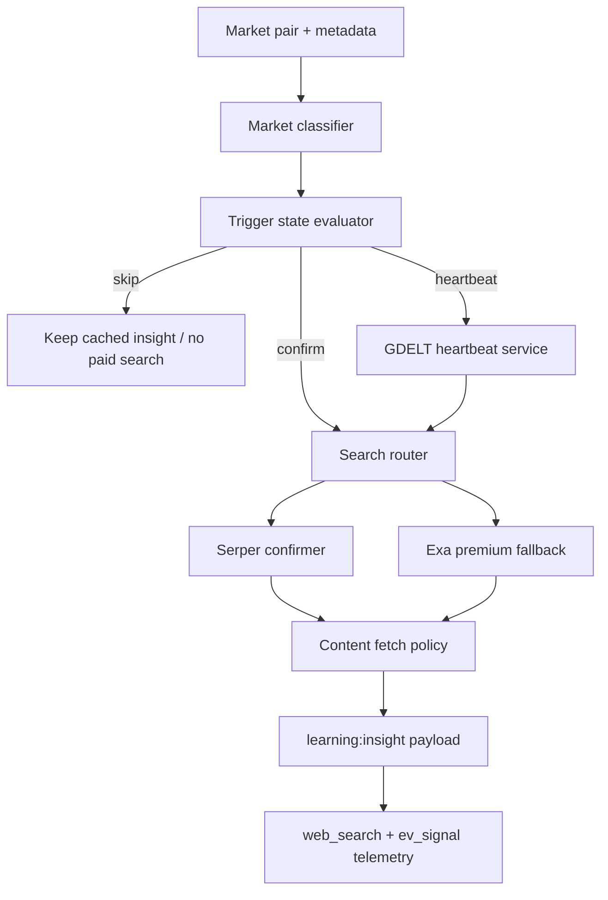

# Search Provider Routing Technical Spec

Detailed technical spec for the EV web-search routing layer derived from [SEARCH_PROVIDER_COST_REVIEW_2026-03-08.md](./SEARCH_PROVIDER_COST_REVIEW_2026-03-08.md) and reconciled against the current implementation on March 10, 2026.

---

## Status

- Status: Proposed
- Scope: EV web-search routing, provider selection, trigger state, telemetry, and rollout contract
- Companion rationale: [SEARCH_PROVIDER_COST_REVIEW_2026-03-08.md](./SEARCH_PROVIDER_COST_REVIEW_2026-03-08.md)
- Current implementation anchor:
  - `src/agents/signal/SignalAggregatorAgent.ts`
  - `src/boot/runtimeServices.ts`
  - `src/services/websearch/{ExaClient,FirecrawlClient,WebSearchCache,WebSearchProviderCache}.ts`
  - `src/config/policy.ts`

---

## Problem Statement

The current EV web-search path is operationally simple but too eager to spend on paid retrieval:

- every eligible uncached market builds up to three queries;
- the primary provider is searched before any cheap trigger layer has determined whether the market deserves paid retrieval;
- the result set can still trigger immediate content fetch for up to eight URLs;
- provider routing is limited to `primary -> secondary on zero results`.

The repo now has better cost controls than the original review assumed, but it still lacks:

- a cheap narrative-change trigger layer;
- routing based on market class, urgency, or ambiguity;
- official-source escalation rules;
- a provider-neutral decision contract that can support GDELT and Serper without hardwiring them into `SignalAggregatorAgent`.

---

## Goals

1. Reduce recurring EV web-search cost without weakening advisory-signal quality.
2. Preserve the existing `search -> fetchContents -> learning:insight` downstream contract.
3. Route cheap monitoring, confirmation, and premium fallback through explicit policy instead of implicit provider order.
4. Keep failures advisory and fail-open.
5. Make spend, latency, routing, and disagreement observable through first-class telemetry.

## Non-Goals

- Rewriting `learning:insight` scoring semantics in this spec.
- Changing near-zero strategy behavior.
- Making GDELT, Serper, or Exa trade-authoritative on their own.
- Defining model-training pipelines for EV calibration.

---

## Current Baseline

### Policy defaults

From `src/config/policy.ts`:

- `evWebSearchExaEnabled=true`
- `evWebSearchFirecrawlEnabled=false`
- `evWebSearchPrimary='exa'`
- `evWebSearchLookbackDays=7`
- `evWebSearchMaxResults=10`
- `evWebSearchCacheTtlSeconds=7200`
- `evWebSearchMaxConcurrency=3`
- `evWebSearchFirecrawlMaxDepth=2`
- `evWebSearchFirecrawlMaxPages=10`

### Runtime activation rules

From `src/boot/runtimeServices.ts`:

- provider clients are only constructed if both policy and provider credentials are present;
- missing credentials emit `web_search` metrics and do not create a degraded client;
- `SignalAggregatorAgent` only exists if at least one provider client is live.

### Current signal path

From `src/agents/signal/SignalAggregatorAgent.ts`:

1. Filter market pairs by allowlist and insight TTL.
2. Resolve market question/outcomes from CLOB metadata.
3. Build up to three queries: base question plus two outcome-appended variants.
4. Search the primary provider.
5. If primary returns zero results, search the secondary provider.
6. Deduplicate URLs.
7. Fetch contents for up to eight URLs from the provider that produced the final results.
8. Normalize into one `learning:insight` payload.

### Current landed controls

- Exa search forced to `type: 'neural'`
- shared bounded `WebSearchCache` (`maxEntries=1000`)
- provider-prefixed search/content cache keys
- Firecrawl crawl depth/page caps
- Exa auth/billing cooldown
- domain allowlist/denylist support
- advisory fail-open behavior

---

## Proposed Architecture



### Logical components

#### 1. `GdeltHeartbeatService`

Responsibilities:

- ingest low-cost market/query heartbeat data on a schedule;
- maintain short-lived trigger features per market;
- answer `shouldEscalate()` with reason codes.

This is not a `WebSearchClient`. It is a separate monitor/cache layer.

#### 2. `SearchRouter`

Responsibilities:

- accept market context plus trigger state;
- decide `skip`, `serper`, `exa`, or `serper_then_exa`;
- enforce market-class-specific escalation rules;
- emit routing telemetry.

This sits ahead of provider clients and removes routing decisions from `SignalAggregatorAgent`.

#### 3. Provider clients

- `SerperClient`: default paid confirmer for Google-grounded search/news.
- `ExaClient`: premium fallback for semantic retrieval or ambiguous cases.
- `FirecrawlClient`: kept as a direct-content or crawl-capable utility where appropriate.

#### 4. `SignalAggregatorAgent`

Responsibilities after the refactor:

- iterate eligible markets;
- ask the router what to do;
- collect search/content outputs from the chosen path;
- emit normalized `learning:insight`.

It should not encode provider policy beyond honoring router output.

---

## Routing Contract

### Proposed types

```ts
type SearchRoute = 'skip' | 'serper' | 'exa' | 'serper_then_exa';

interface SearchRouteDecision {
  route: SearchRoute;
  reason:
    | 'cached'
    | 'low_priority'
    | 'no_trigger'
    | 'gdelt_spike'
    | 'official_confirmation_missing'
    | 'near_resolution'
    | 'price_move_unexplained'
    | 'serper_ambiguous'
    | 'serper_low_authority';
  triggerScore: number;
  queryMode: 'base_only' | 'base_plus_one' | 'base_plus_two';
  contentBudget: number;
}
```

### Stage definitions

#### Stage 0: eligibility

A market is eligible for routing only when all are true:

- allowlisted/active;
- not blocked by insight TTL unless there is an override trigger;
- signal mode includes EV;
- market metadata is available or a fallback query can be built from `marketId`.

Optional prioritizers:

- time to resolution below threshold;
- unexplained price move from internal market data;
- operator-marked priority market.

#### Stage 1: heartbeat

Use GDELT for low-cost trigger generation on high-priority markets.

Tracked heartbeat features:

- article-count delta
- tone delta
- unique-source delta
- geography spread
- novelty score
- contradiction score
- official-domain presence

Output:

- `triggerScore`
- boolean `shouldEscalate`
- list of trigger reasons

#### Stage 2: default confirmation

Use Serper when escalation is justified but premium retrieval is not yet warranted.

Default behavior:

- prefer 1-2 focused queries instead of always using all three variants;
- prefer Google News / Google Search grounded results;
- score authority and official-domain presence before content expansion.

#### Stage 3: premium fallback

Escalate to Exa only when:

- Serper returns too few high-authority hits;
- Serper evidence conflicts materially;
- semantic or long-tail retrieval is required;
- market value/urgency justifies premium spend.

#### Stage 4: content fetch

Content fetch budget must be route-dependent:

- `skip`: 0
- `serper`: top 2-3 URLs by authority/recency
- `exa`: top 2-3 inline or post-search content fetches, subject to current pricing
- `serper_then_exa`: only expand Exa if Serper ended ambiguous

The current unconditional eight-URL cap becomes an upper bound, not the default operating budget.

---

## Market Classification

The router must support at least these market classes:

| Class | Examples | Preferred trigger behavior | Preferred confirmation behavior |
| --- | --- | --- | --- |
| `official_release` | agency reports, court filings, CPI/Fed decisions | escalate quickly on official-domain absence | prefer official domains first |
| `event_narrative` | political/news cycles | heartbeat-heavy | Serper first, Exa on ambiguity |
| `diffuse_sentiment` | broad social narrative markets | stronger trigger threshold | Serper first, low content budget |
| `fast_resolution` | near-expiry markets | bypass slow heartbeat if unresolved move detected | immediate confirmer |

Classification can start as a deterministic ruleset derived from market title/category/tags and later become configurable.

---

## Query Strategy

### Current baseline

- `base`
- `base + outcome1`
- `base + outcome2`

### Required future modes

- `base_only`
- `base_plus_one`
- `base_plus_two`

Selection rules:

- standard binary markets default to `base_plus_one` unless trigger ambiguity requires both outcomes;
- official-release markets should add official entity names/domains where available;
- fallback query generation must remain deterministic.

---

## Config Surface

### Existing config to preserve

- `evWebSearchExaEnabled`
- `evWebSearchFirecrawlEnabled`
- `evWebSearchPrimary`
- `evWebSearchLookbackDays`
- `evWebSearchMaxResults`
- `evWebSearchCacheTtlSeconds`
- `evWebSearchMaxConcurrency`
- `evWebSearchFirecrawlMaxDepth`
- `evWebSearchFirecrawlMaxPages`
- `EV_WEBSEARCH_*`, `EXA_*`, `FIRECRAWL_*`

### Proposed new policy keys

| Key | Type | Purpose |
| --- | --- | --- |
| `evWebSearchRoutingEnabled` | boolean | master switch for router path |
| `evWebSearchDefaultContentBudget` | number | default max expanded documents |
| `evWebSearchHighPriorityContentBudget` | number | expanded budget for premium cases |
| `evWebSearchDefaultQueryMode` | enum | default query mode |
| `evWebSearchNearResolutionMinutes` | number | threshold for urgent escalation |
| `evWebSearchPriceMoveTriggerBps` | number | unexplained move threshold |
| `evWebSearchOfficialDomainRequired` | boolean | stronger official-source enforcement |
| `evWebSearchGdeltEnabled` | boolean | enable heartbeat layer |
| `evWebSearchGdeltRefreshMinutes` | number | heartbeat cadence |
| `evWebSearchGdeltTriggerThreshold` | number | minimum trigger score |
| `evWebSearchSerperEnabled` | boolean | enable default confirmer |
| `evWebSearchExaFallbackEnabled` | boolean | premium fallback switch |

The router should validate invalid combinations the same way `validateP0Config` currently validates `evWebSearchPrimary`.

---

## Telemetry Requirements

### Existing metrics to preserve

- `web_search` event stream
- provider request metrics
- cache hit metrics
- cooldown metrics
- `learning:insight` emissions

### New required metric events

| Event | Required fields |
| --- | --- |
| `route_decided` | `marketId`, `route`, `reason`, `triggerScore`, `queryMode` |
| `route_skipped` | `marketId`, `reason` |
| `heartbeat_updated` | `marketId`, `triggerScore`, `reasons[]` |
| `content_budget_applied` | `marketId`, `route`, `requestedUrls`, `expandedUrls` |
| `provider_disagreement` | `marketId`, `providers`, `reason` |

### Reporting requirements

Track at minimum:

- paid queries per market per day
- content fetches per market per day
- median and p95 provider latency
- route distribution
- cache hit rate
- disagreement rate
- insight emission rate

---

## Failure Handling

Required behavior:

- router failures must fail open and not block EV runtime;
- provider failures remain advisory and emit `web_search` metrics;
- missing GDELT or Serper credentials must degrade cleanly to the remaining configured path;
- content fetch must always use the provider that produced the result set for the current route;
- cooldown and cache behavior must remain provider-isolated.

---

## Security and Source Controls

- preserve domain allowlist/denylist support;
- do not scrape or fetch unsupported domains outside configured provider policy;
- prefer official domains for `official_release` market classes;
- never treat GDELT tone or any single provider hit as trade-authoritative.

---

## Testing Requirements

### Unit coverage

Must cover:

- route selection per market class
- GDELT trigger threshold behavior
- query mode reduction from 3 to 1-2 queries
- Serper-first and Serper-then-Exa paths
- provider-aligned content fetch
- route-specific content budget application
- invalid config combinations
- fail-open behavior on router or provider errors

### Integration coverage

Must verify:

- `SignalAggregatorAgent` still emits one normalized `learning:insight` payload;
- current metrics and cache semantics remain intact;
- runtime assembly only constructs clients when credentials exist.

### Regression requirements

Keep the existing regression cases for:

- fallback content fetch provider alignment;
- default outcome handling when market metadata is absent.

---

## Rollout Plan

### Phase 0

Land router scaffolding behind deterministic config without changing provider defaults.

### Phase 1

Reduce query/content budgets within the current Exa-first path:

- default query mode from `base_plus_two` to `base_plus_one`
- default content budget below 8
- keep current fallback semantics

### Phase 2

Introduce Serper as default confirmer and GDELT as heartbeat.

### Phase 3

Restrict Exa to premium fallback after telemetry proves parity or better cost-quality tradeoff.

---

## Acceptance Criteria

- [ ] New routing logic preserves downstream `learning:insight` contract.
- [ ] Provider selection is explicit, measurable, and config-driven.
- [ ] Cheap trigger state exists before default paid confirmation.
- [ ] Exa is no longer the unconditional first paid retrieval step for every eligible market.
- [ ] Route, latency, spend, and disagreement telemetry are queryable through existing metrics surfaces.
- [ ] Unit and integration tests keep repo coverage above enforced thresholds.
- [ ] Dashboard and backend build/test gates remain green after adoption.

---

## Open Questions

- Should `SerperClient` live under `src/services/websearch/` beside Exa/Firecrawl or behind a more generic router package?
- Should official-domain matching be deterministic config, market metadata, or both?
- Should GDELT heartbeat state be persisted across restarts or remain in-memory with short TTL only?
- How much Exa inline-content evaluation should be done before deciding between inline and `/contents` retrieval?
